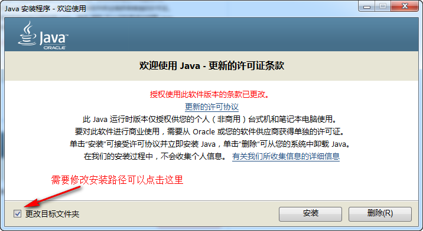
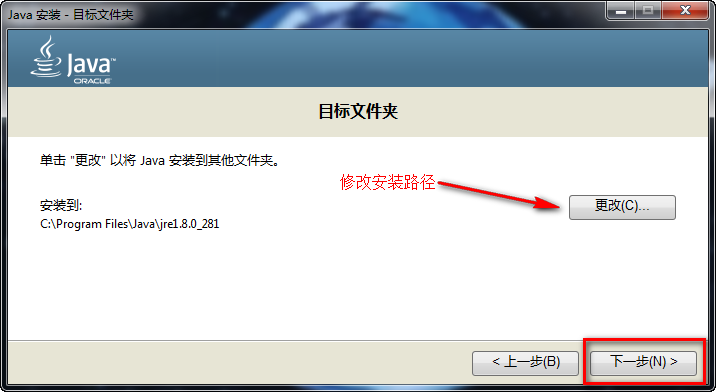
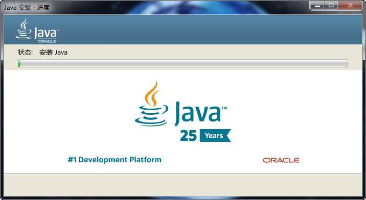
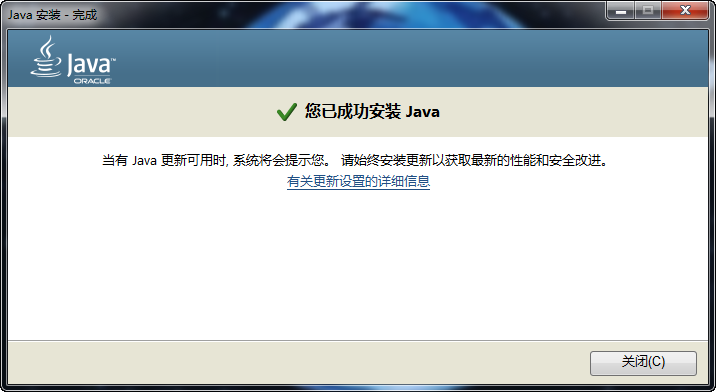

# 安装 STM32CubeMX 软件

> *本小节详细介绍如何安装和使用 STM32CubeMX 软件。*

STM32CubeMX 软件是 STM32 ARM Cortex-M 微控制器的图形配置和底层代码生成工具。近年来，STMicroelectronics 公司一直大力推广 HAL + STM32CubeMX 的开发方式，STM32CubeMX 软件可以通过图形化向导可以快速、轻松配置 STM32 系列单片机的底层驱动，并生成相应的初始化 C 代码。从此，我们不需要像建立各种文件夹、复制各种各样的库文件才能新建一个工程。当你熟悉使用 STM32CubeMX 软件后，你不会想回滚使用以前的老旧的新建工程方法。

## 相关链接

* JRE（Java Runtime Environment）下载：[Java官网](https://www.java.com/zh-CN/download/)
* STM32CubeMX 官方网站下载地址： [ST官网](https://www.st.com/zh/development-tools/stm32cubemx.html)

> *开发者可以在上述官网地址下载对应的环境和软件。*

## 具体步骤

### 安装 JRE

由于 STM32CubeMX 软件是基于 Java 环境运行的，所以需要安装 JRE （Java Runtime Environment）才能安装使用。

有两个途径可以下载 JRE：

1. 去[Java官网](https://www.java.com/zh-CN/download/)
2. 配套光盘或资料包（路径：`光盘\07、开发工具安装包\jre-8u281-windows-x64.exe`）

双击exe安装包，进行安装。

修改路径，点下一步。

等待安装完成。

安装完成，关闭界面。

### 安装 STM32CubeMX

有两个途径可以下载 STM32CubeMX：

1. 去[ST官网](https://www.st.com/zh/development-tools/stm32cubemx.html)
2. 配套光盘或资料包（路径：`光盘\07、开发工具安装包\STM32CubeMX安装包\en.stm32cubemx_v6-1-1.zip`）

对安装进行解压缩，双击 exe 可执行文件文件进行安装。进入安装界面，点击 “Next”。

选择 “I accept ...” 接受使用协议，点击 “Next”。

选择安装路径。默认路径安装也行。我习惯安装将系统无关软件安装到D盘，所以示例中将 C 盘改成 D 盘，其他不变。点击 “Next”。

选择在开始菜单创建快速图标，和在桌面创建快捷方式。直接默认，点击“Next”。

进入自动安装环节，稍等片刻就能完成。待安装完成后，点击 “Next”。

安装成功，提示 “Installation has completed successfully”。点击 “Done”，退出安装界面。

