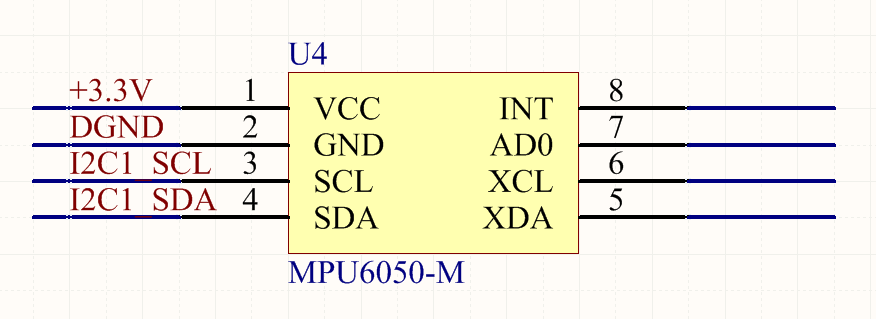
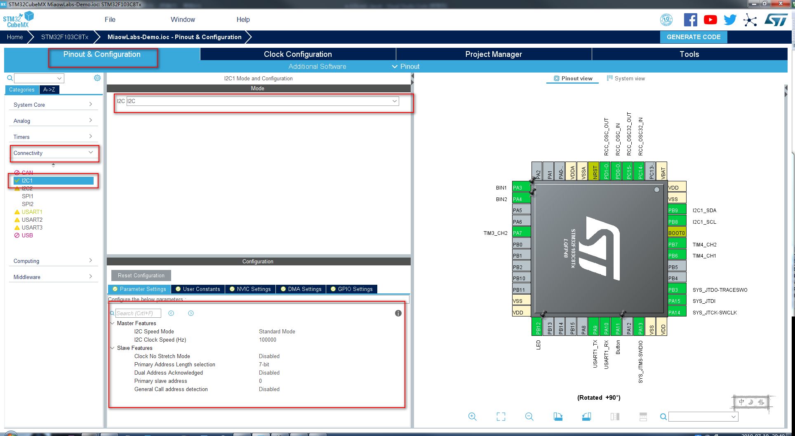
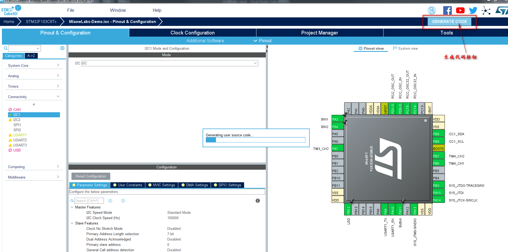
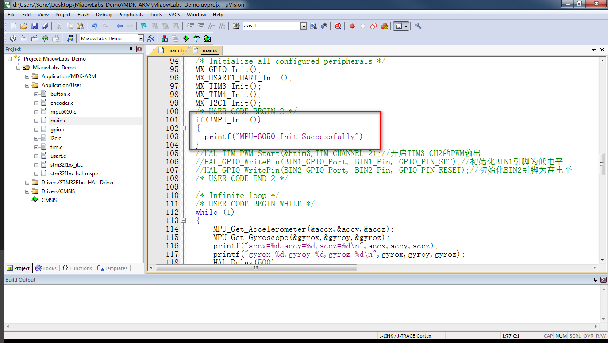
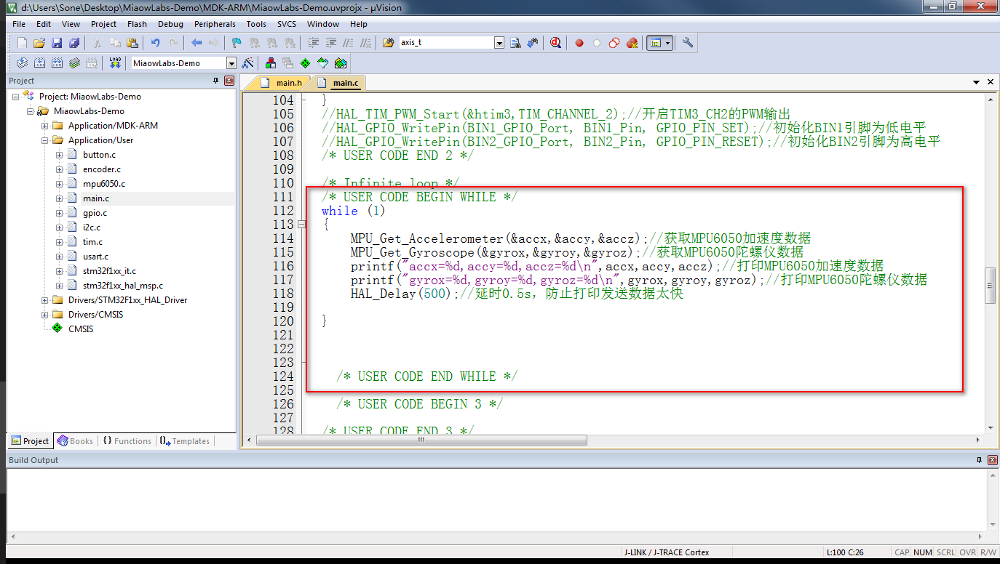
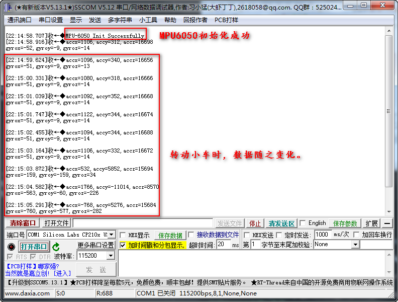

# 硬件I2C读取MPU6050原始数据

> *本小节教你使用 STM32CubeMX 配置 STM32 的 硬件 I2C，并通过 I2C 读取 MPU-6050 传感器的陀螺仪、加速度计数据。*

### 预先了解



通过上面原理图得知，「小霸王Lite」两轮自平衡小车通过 STM32 的 I2C1 接口与 MPU-6050 传感器进行通信。我们这里使用的是轮询模式，只需要配置 PB8：I2C1_SCL、PB9：I2C1_SDA。如果使用中断模式，则还要使用一个 GPIO 引脚连接 MPU-6050 模块的 INT 引脚。

### 具体步骤

进入我们上一小节修改过的 MiaowLabs-Demo 文件夹，找到 MiaowLabs-Demo.ioc 工程文件，双击，打开工程。在左侧 Pinout&Configuration 界面中的 Connectivity 下拉中点击 I2C1，然后在 I2C1 Mode and Configuration 的 Mode 中将 I2C 选择为 I2C。而其他地方，比如 Configuration 中的 Parameter Setting 选项卡全部保持默认参数（标准模式，100k 速率）即可。



点击 GENERATE CODE，重新生成代码。



从光盘中（路径：光盘\03、教程\03、配套教程的API文件\），找到已经用 STM32 HAL 库封装好的 MPU6050 代码文件： `mpu6050.c`、`mpu6050.h`，这两个文件主要就是使用 HAL 库里的 I2C 函数进行改写，可以直接调用。

将 `mpu6050.c` ，复制到 MiaowLabs-Demo 文件夹的 Src 文件夹里。


将 `mpu6050.h` 复制到 MiaowLabs-Demo 文件夹的 Inc 文件夹里。


打开 MDK-ARM 软件，在左侧目录中双击 Application/User，将 Src 文件夹的 `mpu6050.c` 加入工程。


打开 main.h 头文件，在 `/* USER CODE BEGIN Includes */` 和 `/* USER CODE END Includes */` 之间加入 `mpu6050.h` 文件：

```c
/* Private includes ----------------------------------------------------------*/
/* USER CODE BEGIN Includes */
#include "button.h"
#include "encoder.h"
#include "mpu6050.h"
/* USER CODE END Includes */
```


打开 main.c 文件，在 `/* USER CODE BEGIN 1 */` 和 `/* USER CODE END 1 */` 之间定义以下新变量，并且将上个实验的变量注释掉：

```c
  /* USER CODE BEGIN 1 */
    //int iTempTim4Encoder;///临时存放从TIM4编码器接口捕获到的脉冲数据
    short accx,accy,accz;//加速度x轴、y轴、z轴数据
    short gyrox,gyroy,gyroz;//陀螺仪x轴、y轴、z轴数据
  /* USER CODE END 1 */
```

在 `/* USER CODE BEGIN 2 */` 和 `/* USER CODE END 2 */` 之间敲入以下新代码，注释掉上个实验留下的代码：

```c
  /* USER CODE BEGIN 2 */
	if(!MPU_Init())//如果MPU6050初始化成功，返回0，!0则为1
  {
		printf("MPU-6050 Init Successfully");//成功了则打印 MPU-6050 Init Successfully
	}
	//HAL_TIM_PWM_Start(&htim3,TIM_CHANNEL_2);//开启TIM3_CH2的PWM输出
	//HAL_GPIO_WritePin(BIN1_GPIO_Port, BIN1_Pin, GPIO_PIN_SET);//初始化BIN1引脚为低电平
	//HAL_GPIO_WritePin(BIN2_GPIO_Port, BIN2_Pin, GPIO_PIN_RESET);//初始化BIN2引脚为高电平
  /* USER CODE END 2 */
```


在主循环中敲入以下代码：

```c
  /* USER CODE BEGIN WHILE */
  while (1)
  {
		MPU_Get_Accelerometer(&accx,&accy,&accz);//获取MPU6050加速度数据
	    MPU_Get_Gyroscope(&gyrox,&gyroy,&gyroz);//获取MPU6050陀螺仪数据
		printf("accx=%d,accy=%d,accz=%d\n",accx,accy,accz);//打印MPU6050加速度数据
		printf("gyrox=%d,gyroy=%d,gyroz=%d\n",gyrox,gyroy,gyroz);//打印MPU6050陀螺仪数据
		HAL_Delay(500);	//延时0.5s，防止打印发送数据太快
  }
    /* USER CODE END WHILE */
```



在 MDK-ARM 中重新编译代码，把代码烧录进小车的 MiaowLabs-STM32F1-Micro 核心板（小车提前组装好），并用数据线连接核心板和电脑，打开喵呜地面站或其他串口助手软件，我们用手按一下核心板的复位按钮，能够看到小车发送 MPU-6050 Init Successfully 到串口助手上，代表 MPU6050 初始化成功，而且每隔 0.5 秒就将加速度和陀螺仪数据发送上去，我们转动小车可以看到数据随之变化。



就这样，我们成功读取了 MPU6050 传感器的原始数据。


