# MPU-6050姿态解算和数据融合

> *本小节对 MPU-6050 传感器的原始数据进行姿态解算，然后再利用数据融合算法得到精准的角度。*

在上两小节中，我们已经读到 MPU-6050 传感器的原始数据，学习了加速度传感器、陀螺仪的工作原理、姿态解算，并对互补滤波有所了解。在本小节中，我们结合 STM32CubeMX、MDK-ARM 软件，对 MPU-6050 传感器数据进行姿态解算和数据融合。

### 具体步骤

进入我们上一小节修改过的 MiaowLabs-Demo 文件夹，再打开里面的 MDK-ARM 文件夹，找到 MiaowLabs-Demo.uvprojx 工程文件，双击，打开工程。在 MDK-ARM 工程界面，按下组合键 Ctrl+N（按住 Ctrl 键再按 N 键），新建一个文件，再按下组合键 Ctrl+S，文件名改为 filter.c，保存到 MiaowLabs-DEMO 的 Src 文件夹里，接着在 MDK-ARM 工程界面左侧 Project 栏目双击 Application/User 文件夹，把 filter.c 加进来。

双击 filter.c 源文件，敲入以下代码：

```c
#include "filter.h"//加入头文件

//互补滤波器
// a = tau / (tau + dt)  
// acc = 加速度传感器数据 
// gyro = 陀螺仪数据 
// dt = 运行周期       
float angle;
float a;

float ComplementaryFilter(float acc, float gyro, float dt) 
{
    a = 0.98;  
    angle = a * (angle + gyro * dt) + (1 - a) * (acc);  
    return angle;  
}
```

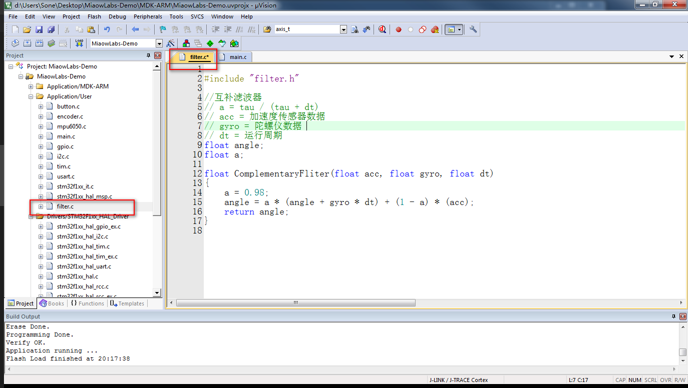

filter.c 源文件中暂时就只是封装了一个互补滤波的函数。

上面代码添加了头文件，但我们还没创建头文件呢，再新建一个文件 filter.h 头文件，把文件保存到 Inc 文件夹。然后，把下面代码敲进去。

```c
#ifndef __FILTER_H
#define __FILTER_H

float ComplementaryFilter(float acc, float gyro, float dt);

#endif
```

在 MDK-ARM 工程界面，按下组合键 Ctrl+N（按住 Ctrl 键再按 N 键），新建一个文件，再按下组合键 Ctrl+S，文件名改为 control.c，保存到 MiaowLabs-DEMO 的 Src 文件夹里，接着在 MDK-ARM 工程界面左侧 Project 栏目双击 Application/User 文件夹，把 control.c 加进来。

双击 control.c 源文件，敲入以下代码：

```c
#include "control.h"
#include "filter.h"
#include "mpu6050.h"
#include "math.h"

short x_nAcc,y_nAcc,z_nAcc;//加速度x轴、y轴、z轴数据
short x_nGyro,y_nGyro,z_nGyro;//陀螺仪x轴、y轴、z轴数据
float x_fAcc,y_fAcc,z_fAcc;

float g_fAccAngle;//加速度传感器经过atan2()解算得到的角度
float g_fGyroAngleSpeed;//陀螺仪角速度
float g_fCarAngle;//小车倾角
float dt = 0.005;//互补滤波器控制周期

unsigned char g_ucMainEventCount;//主事件计数，会用在中断中

void GetMpuData(void)//获取MPU-6050数据函数
{
	MPU_Get_Accelerometer(&x_nAcc,&y_nAcc,&z_nAcc);//获取MPU-6050加速度数据
	MPU_Get_Gyroscope(&x_nGyro,&y_nGyro,&z_nGyro); //获取MPU-6050陀螺仪数据
}

void AngleCalculate(void)//角度计算函数
{
	//-------加速度数据处理--------------------------
	//量程为±2g时，灵敏度：16384 LSB/g
    x_fAcc = x_nAcc / 16384.0;
    y_fAcc = y_nAcc / 16384.0;
    z_fAcc = z_nAcc / 16384.0;
    
    g_fAccAngle = atan2(y_fAcc,z_fAcc) * 180.0 / 3.14;

    //-------陀螺仪数据处理-------------------------
    //范围为2000deg/s时，换算关系：16.4 LSB/(deg/s)
	g_fGyroAngleSpeed = x_nGyro / 16.4;//计算角速度值 			   	
	
	//-------互补滤波---------------
	g_fCarAngle = ComplementaryFilter(g_fAccAngle, g_fGyroAngleSpeed, dt);
}

```

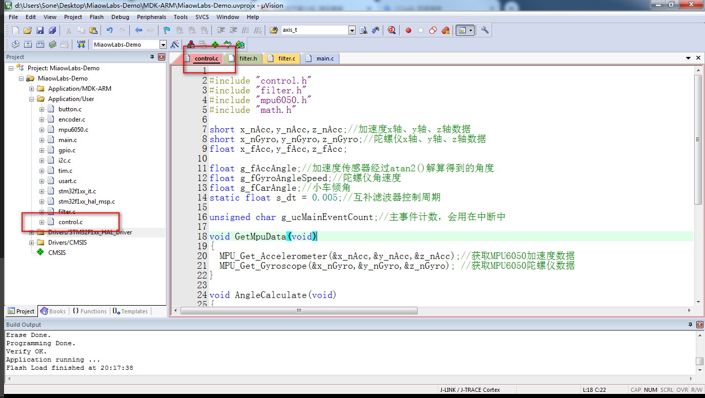

函数 GetMpuData() 的主要作用，就是分别获取 MPU-6050 传感器的三轴加速度、三轴陀螺仪数据，并将数据存入 x_nAcc、y_nAcc、z_nAcc、x_nGyro、y_nGyro、z_nGyro 变量中。

函数 AngleCalculate() 的主要作用，就是先将加速度数据除于灵敏度，将加速度数据由 LSB 转化成 g，注意这时变量类型为了保持精度为使用了 float 类型，再使用 atan2() 函数计算出角度，这时的角度单位为弧度，先除 3.14 再乘 180°，将单位转换成我们日常用的度。然后，将陀螺仪数据除于灵敏度，得到角速度，单位为 deg/s。最后，将加速度初算的角度和陀螺仪角速度送入互补滤波器进行数据融合，得到最终的稳定的精准的小车倾角。

注意这里我们定义 dt = 0.005，即 5ms，要怎么样才能实现精准的 5ms 运行一次呢？放在主循环中是不可靠的，因为按顺序运行，无法精确地控制时间。唯有靠定时中断，我们可以将关键代码放在我们先前用过的 SysTick_Handler() 滴答定时器中断服务函数中，以期实现精准的运行。 

注意到上面代码已经添加了 math.h 头文件。只有添加 math.h 头文件，才可以正常使用 atan2() 反正切函数。

再新建一个文件 control.h 头文件，把文件保存到 Inc 文件夹。然后，把下面代码敲进去：

```c
#ifndef __CONTROL_H
#define __CONTROL_H

#include "filter.h"

extern unsigned char g_ucMainEventCount;
extern float g_fCarAngle;

void GetMpuData(void);
void AngleCalculate(void);

#endif 
```

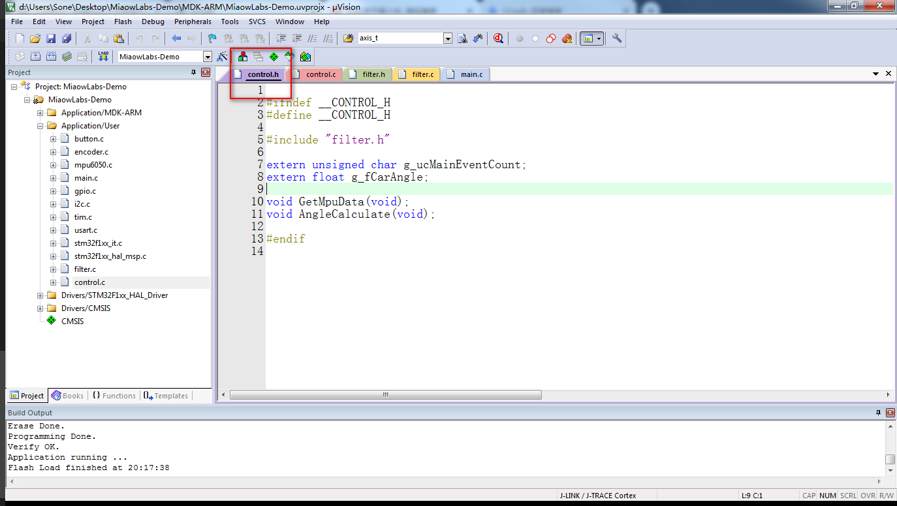

打开 main.h 头文件，将 control.h 头文件添加进去。

```c
#include "control.h"
```

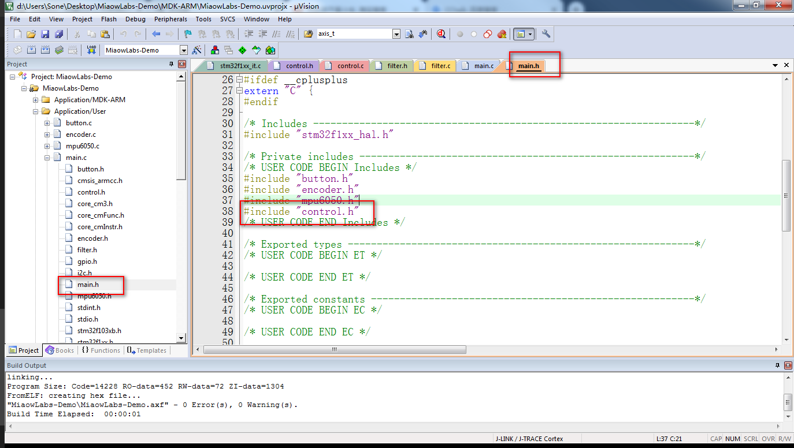

这里不把 filter.h 头文件添加进去，我们已经在 control.h 里面包含了 filter.h 头文件，因此不必在这里再重复添加。

在 MDK-ARM 左侧 Application/User 文件夹中，找到 stm32f1xx_it.c 源文件，双击打开，将以下代码敲入 SysTick_Handler() 函数中：

```c
  /* USER CODE BEGIN SysTick_IRQn 0 */
	
  g_ucMainEventCount++;
  if(g_ucMainEventCount>=5)
	{
        g_ucMainEventCount=0;
        GetMpuData();				   //读取MPU6050数据函数，每5ms执行一次
        AngleCalculate();			 //角度环计算函数，每5ms执行一次
	}

  /* USER CODE END SysTick_IRQn 0 */
```

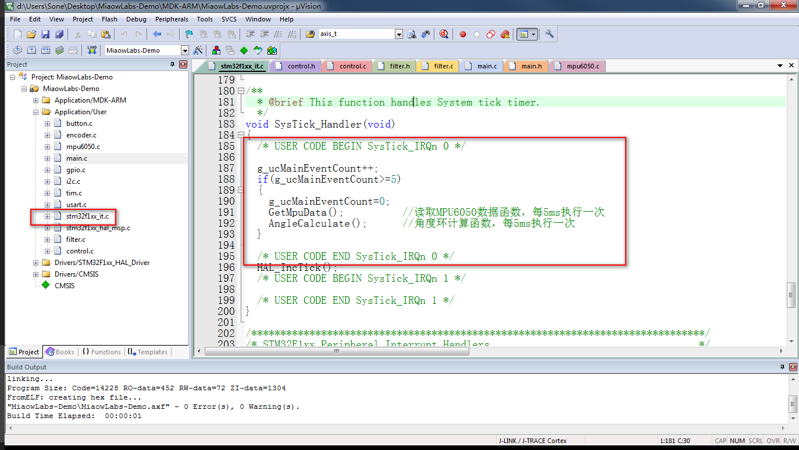

在 main.c 主循环中添加以下代码：

```c
printf("小车角度 = %f",g_fCarAngle);//打印实时角度	 
HAL_Delay(500);//延时0.5s，防止打印发送数据太快		
HAL_GPIO_TogglePin(LED_GPIO_Port,LED_Pin);//指示灯
```

点击编译按钮，重新进行编译，这时没有报错。但是烧录代码会发现不仅数据发送不出，甚至连指示灯都不闪烁。

注意中断服务函数里的代码：

```c
  /* USER CODE BEGIN SysTick_IRQn 0 */
	
  g_ucMainEventCount++;
  if(g_ucMainEventCount>=5)
	{
        g_ucMainEventCount=0;
        GetMpuData();				   //读取MPU6050数据函数，每5ms执行一次
        AngleCalculate();			 //角度环计算函数，每5ms执行一次
	}

  /* USER CODE END SysTick_IRQn 0 */
```

因为这段代码是在 1ms 内运行完，所以要确保函数 GetMpuData() 和 AngleCalculate() 能在 1ms 内就运行完毕。

而函数 GetMpuData() 里面的 函数 MPU_Get_Accelerometer() 和 MPU_Get_Gyroscope() 都调用了 MPU_Read_Len() 这个函数，里面有一句延时代码 `HAL_Delay(100);`。也就是说，运行完这段代码要 100ms+ 的时间，在 1ms 中断里根本运行不完，压根没有时间给到主循环执行其他代码，所以发送不出数据，指示灯也不闪。

我们将延时函数 `HAL_Delay(100);` 注释掉，加快 I2C 读取速度，并不影响 I2C 正常工作。

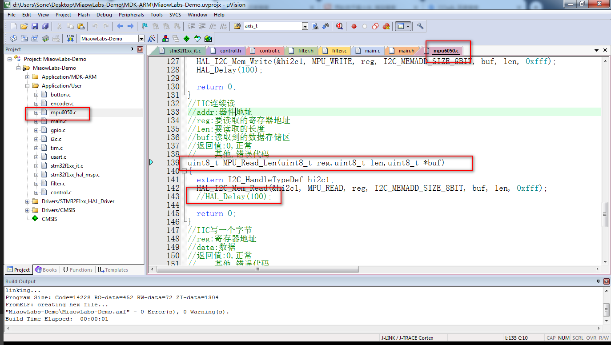

点击编译按钮，重新进行编译，这时没有报错。将代码烧录进小车中，会看到指示灯每 0.5s 闪烁一次。

插上 Micro-USB 数据线，打开串口助手，可以看到随着小车倾斜角度变化，发送到串口助手上的数据也随之变化。

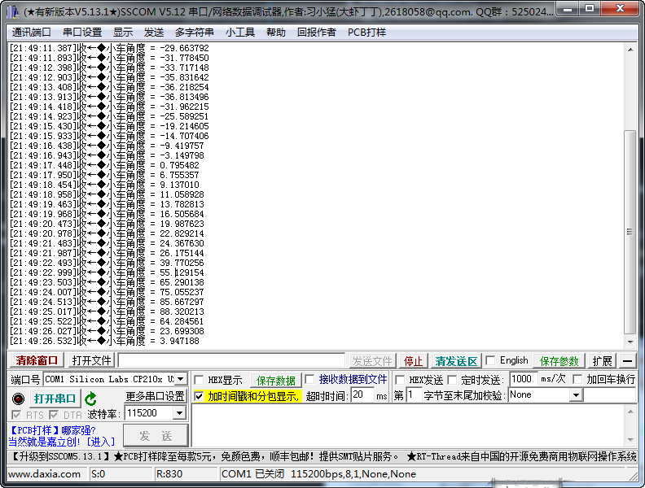

### 使用喵呜地面站

使用 printf() 函数打印输出角度到串口助手上，虽然可以看到大致的角度效果，但不够直观，而且无法看到加速度、陀螺仪、融合后的角度之间的联系。接下来，我们将加速度、陀螺仪、角度等参数，通过曲线波形输出，更加直观地观察数据之间的关系。

喵呜地面站就是一款虚拟示波器软件，支持多通道数据显示，波特率最大可以稳定上到 912600bps，还可以对图形进行缩放和拖动，是调试平衡小车的利器，而且使用起来也非常方便。界面如下所示。

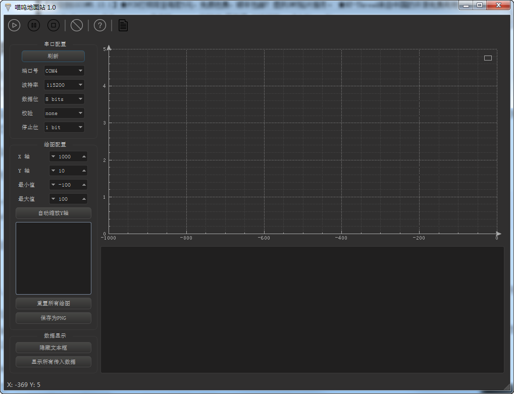

喵呜地面站的使用方法非常简单，只需发送指定格式数据即可：每一行必须以“$”开头，以“;”结尾。这些值必须以空格分隔。

示例：

```c
printf("$%d %d;", rawData, filteredData);
wait_ms(10);
```

下面我们进行具体的步骤讲解。

进入 MiaowLabs-Demo 文件夹，再打开里面的 MDK-ARM 文件夹，找到 MiaowLabs-Demo.uvprojx 工程文件，双击，打开工程。

打开 control.h 头文件，加入以下外部变量声明，以便我们在其他地方调用：

```c
extern float g_fAccAngle;//加速度传感器经过atan2()解算得到的角度
extern float g_fGyroAngleSpeed;//陀螺仪角速度
extern float g_fCarAngle;//小车倾角
```

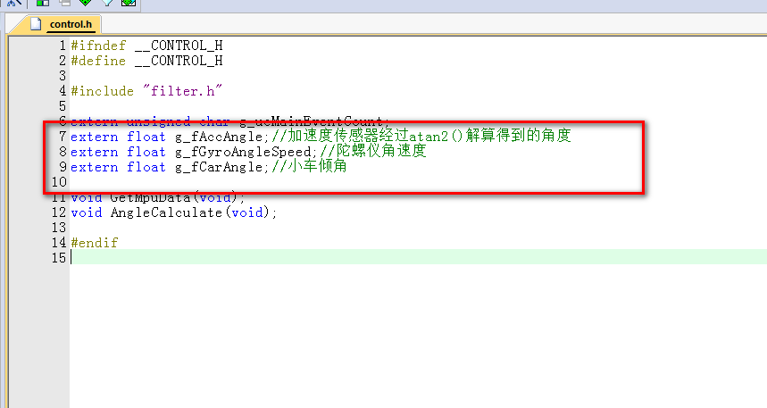

然后在 main.c 文件中，把我们想要显示的数据放到主循环中，这样不会影响中断的运行。

```c
printf("$%.1f %.1f %.1f;", g_fAccAngle, g_fGyroAngleSpeed ,g_fCarAngle);
```

可以看到，我们这里要显示的就是刚才外部声明过的变量，分别是加速度计算得到的角度、陀螺仪角速度、数据融合后的小车角度，这里要注意，因为我们的这里写的顺序是 g_fAccAngle、g_fGyroAngleSpeed、g_fCarAngle，即 g_fAccAngle 对应通道0、g_fGyroAngleSpeed 对应通道1、 g_fCarAngle 对应通道3。通道是从0开始数的。如果你在后面加上其他数据，则依次类推。

用数据线连接小车核心板和电脑USB接口，先解压喵呜地面站压缩包（切勿直接在压缩包内双击EXE文件，无法运行的），然后再打开喵呜地面站。这时，软件能自动识别出小车串口，如图所示。

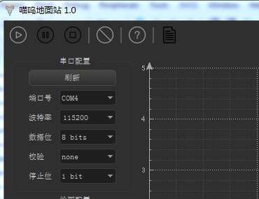

在连接好小车核心板和电脑时，如果喵呜地面站无法识别串口，那么关闭软件重新打开即可。

点击左上角三角形运行按钮，软件则开始接受小车发送过来的数据，晃动小车，则可以显示出波形，在默然情况下，Y轴不会自动缩放波形，这时点击左侧“自动缩放Y轴按钮”，则可以自动缩放波形。

点击运行旁边的按钮，则可以进行暂停。

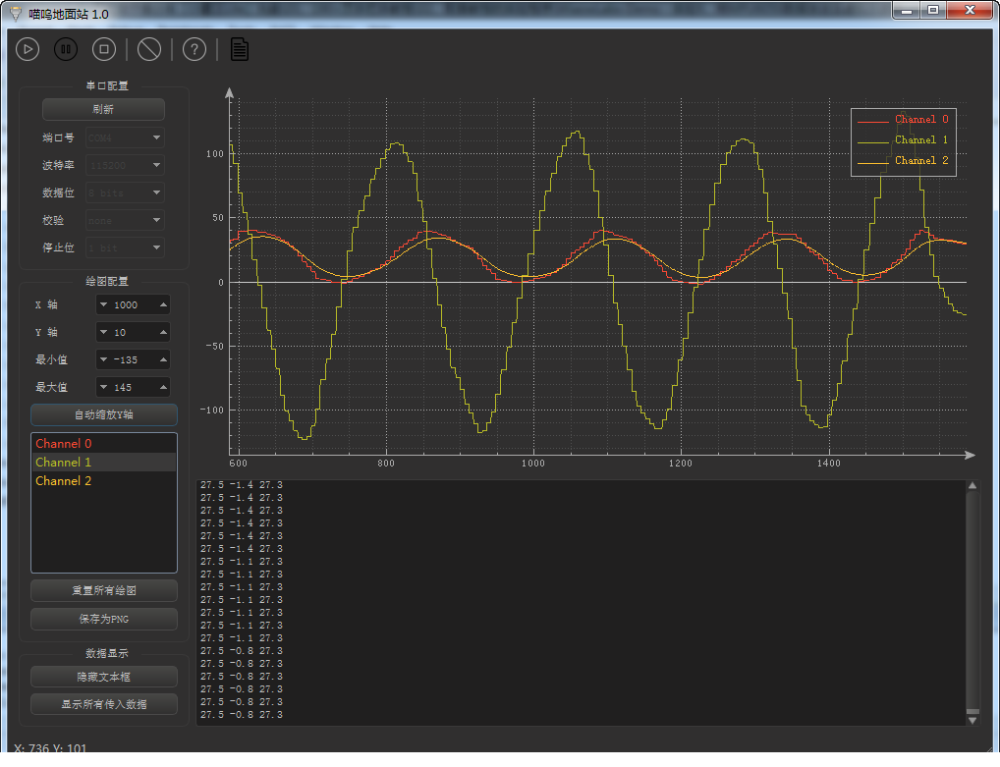

我们已知三条曲线分别为加速度、陀螺仪和角度，那么可以双击绘图区右上角通道名称对波形进行重命名。如图所示。

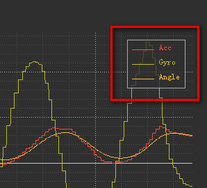


把鼠标指针放在波形中，滑动鼠标滚轮，则可以对图形进行放大缩小。

点击保持为PNG，则可以把当前波形图保存为PNG图片，并保持在喵呜地面站文件夹内。

