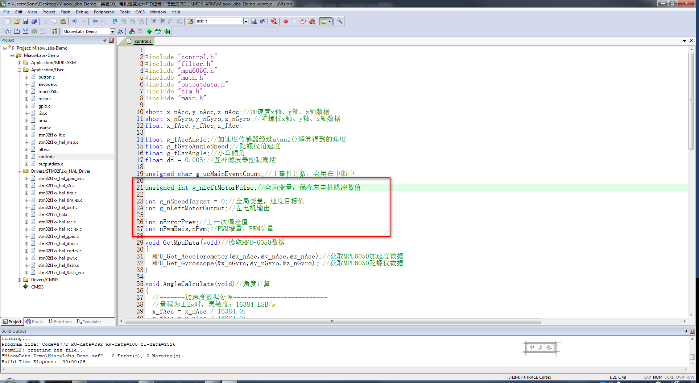
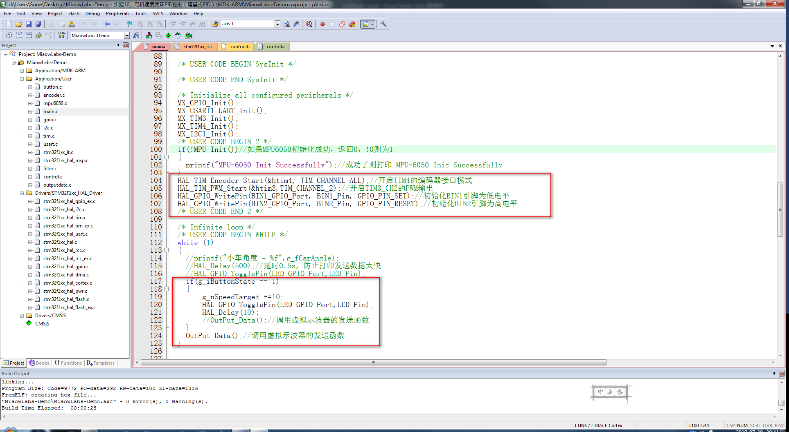
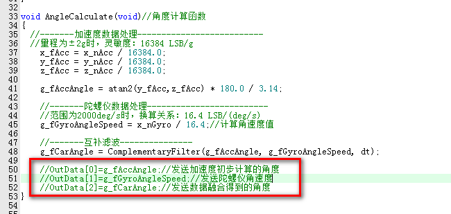
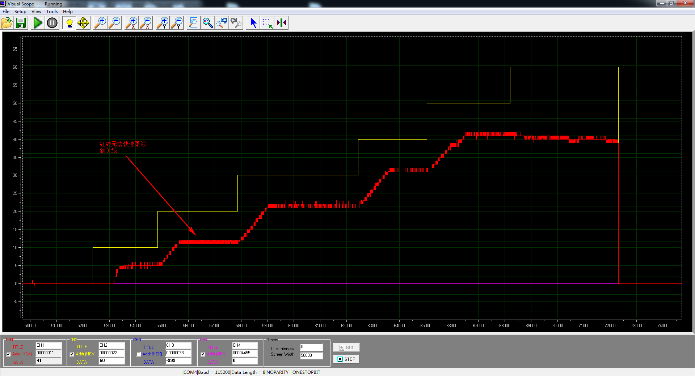
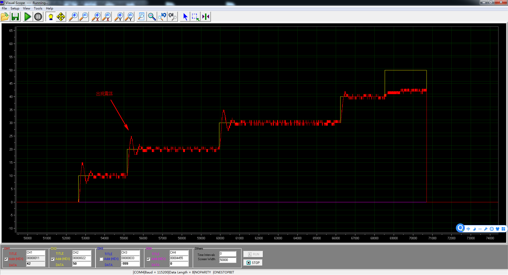
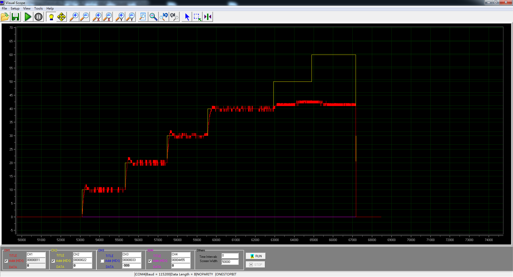
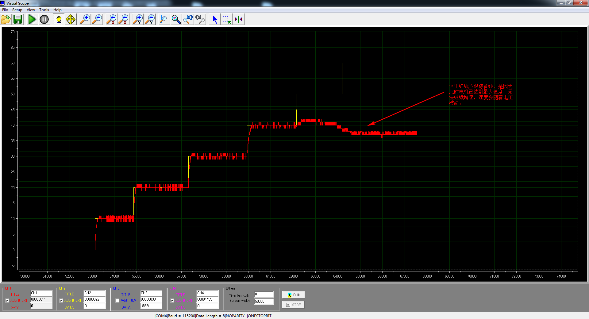

# 电机速度闭环内环PID控制

> 本小节教你使用增量式 PID 算法，对带编码器的直流减速电机进行速度闭环内环控制。

注意：在两轮自平衡小车并没有用到速度闭环内环PID控制，通常用在三轮小车、四轮小车上。把这个章节额外放在这里是因为前面讲到了 PID 控制原理，接着讲这个会比较容易理解。

### 闭环控制

闭环控制，即通过反馈环节，测量被控制对象的变化，用以修正电机输出的控制技术。

对于要求不高的应用，通常采用简单的开环控制。例如，给直流有刷电机的两根引线通电，电机就会旋转；施加的电压越高，电机转速越高，力量越大。但是在很多需要精密控制的场合，仅仅这种方式还是不够的，还需要依靠一定的反馈装置，将电机的转速或位置信息反馈给微控制器或其他的机械装置，通过一定的算法变成可以调节电机控制信号的输出，从而使电机的实际转速、位置等参数与我们所希望的一致。机器人控制是一个精度要求比较高的领域，例如，基于以下的一些考虑，机器人平台需要使用闭环控制。

* 开环控制情况下，移动机器人在爬坡时，电机速度会下降。更糟糕的是，当双轴独立驱动的移动机器人以一定的角度接近斜坡时。每一个车轮转速的下降值将会不同，结果是机器人的实际运动轨迹是沿着一条曲线而不是直线行进。

* 不平坦的地面会造成移动机器人的两个车轮转速之间的差异。如果转速较低的车轮的驱动电机没有得到相应的电压补给，移动机器人将偏移既定的路线。

* 由于安装工艺、负载不完全均衡等原因，即使是完全匹配的两个电机，并在相同的输入电压条件下，他们的速度有时仍会产生不同，即转速差。

* 如果采用的是 PWM 控制，即使在 PWM 信号占空比不变的条件下，随着电池电压的逐渐下降，电机供给电压也会随之降低，从而导致电机的转速与给定值不完全一致。

综合以上的一些考虑，必须选择闭环控制的方式，其工作流程如下图所示：闭环系统中加上了反馈环节（通常机器人的驱动电机使用的是增量式编码器）。在闭环控制系统中，速度指令值通过微控制器变换到功放驱动电路，功放驱动电路再为电机提供能量。编码器用于测量车轮速度的实际值并将其回馈给微控制器。基于实际转速与给定转速的差值，即“偏差”，驱动器按照一定的计算方法（如 PID 算法）调整相应的电压供给，如此反复，直到达到给定转速。

### M 法测速原理

在《Timer编码器模式读取编码器》一节中，我们已经用到 M 法测速，但并未对其原理作讲解。M 法测速原理其实很简单，就是数固定时间段内的脉冲数，再用脉冲数除于时间得到速度。脉冲数是速度的一个表征量，用固定时间段内累计的脉冲数除于该固定时间，就可以求得该固定时间段的平均速度。固定时间段的时间越短，所求得的速度就越接近瞬时速度。

我们的电机上装有霍尔编码器，编码器的码盘跟电机转子同轴安装，电机转动时，码盘也随轴同转，并且转一圈会输出一定数量的脉冲。M 法是数固定时间内产生的脉冲数，在实际工程中比较好实现。而 T 法是数两个脉冲间隔的时间，T 法测速在实际工程中比较少用。

### 速度闭环 PID 控制

> *以下内容使用到上位机——虚拟示波器，其具体移植、使用方法已经在《MPU6050姿态解算和数据融合》一节中进行说明，本节不再具体讲解其移植方法，请萌新们自行温习之前的章节，按部就班来学习。*

速度闭环 PID 控制，就是用速度测量值与目标值进行作差，得到控制偏差，然后通过对偏差的 PID 控制，使偏差趋向于零。

进入我们上修改过的 MiaowLabs-Demo 文件夹，再打开里面的 MDK-ARM 文件夹，找到 MiaowLabs-Demo.uvprojx 工程文件，双击，打开工程。在 MDK-ARM 工程界面，在左侧 Project 栏目下的 Application/User 文件夹里找到 control.c 源文件，双击打开该文件。

添加头文件

```c
#include "tim.h"
```

添加以下变量：
```c
unsigned int g_nLeftMotorPulse;//全局变量，保存左电机脉冲数值

int g_nSpeedTarget = 0;//全局变量，速度目标值
int g_nLeftMotorOutput;//左电机输出

int nErrorPrev;//上一次偏差值
int nPwmBais,nPwm;//PWM增量，PWM总量
```



添加以下函数：
```c
void GetMotorPulse(void)//读取电机脉冲
{
	g_nLeftMotorPulse = (short)(__HAL_TIM_GET_COUNTER(&htim4));//获取计数器值
	__HAL_TIM_SET_COUNTER(&htim4,0);//计数器清零
}

int SpeedInnerControl(int nPulse,int nTarget)//速度内环控制
{
	int nError;//偏差
	float fP = 10.0, fI = 0.9;//这里只用到PI，参数由电机的种类和负载决定

	nError = nPulse - nTarget;//偏差 = 目标速度 - 实际速度 
	
	nPwmBais = fP * (nError - nErrorPrev) + fI * nError;//增量式PI控制器
	
	nErrorPrev = nError;//保存上一次偏差
	
	nPwm += nPwmBais;//增量输出
	
	if(nPwm > 999) nPwm = 999;//限制上限，防止超出PWM量程
	if(nPwm <-999) nPwm =-999;
	
	OutData[0]=(float)nPulse;//速度实际值
	OutData[1]=(float)nTarget ;//速度目标值
	OutData[2]=(float)nPwm;//PWM输出值
	
	return nPwm;//返回输出值
}

void SetMotorVoltageAndDirection(int nMotorPwm)//设置电机电压和方向
{
	if(nMotorPwm < 0)//反转
		{
			HAL_GPIO_WritePin(BIN1_GPIO_Port, BIN1_Pin, GPIO_PIN_SET);
			HAL_GPIO_WritePin(BIN2_GPIO_Port, BIN2_Pin, GPIO_PIN_RESET);
			nMotorPwm = (-nMotorPwm);//如果计算值是负值，先取负得正，因为PWM寄存器只能是正值
			__HAL_TIM_SET_COMPARE(&htim3, TIM_CHANNEL_2, nMotorPwm);
		}else
		{
			HAL_GPIO_WritePin(BIN1_GPIO_Port, BIN1_Pin, GPIO_PIN_RESET);
			HAL_GPIO_WritePin(BIN2_GPIO_Port, BIN2_Pin, GPIO_PIN_SET);
			__HAL_TIM_SET_COMPARE(&htim3, TIM_CHANNEL_2, nMotorPwm);
		}
}
```


在 control.h 头文件中，声明全局变量和相关函数：

```c
#ifndef __CONTROL_H
#define __CONTROL_H

#include "filter.h"

extern unsigned char g_ucMainEventCount;
extern float g_fCarAngle;
extern unsigned int g_nLeftMotorPulse;
extern int g_nSpeedTarget;
extern int g_nLeftMotorOutput;

void GetMpuData(void);
void AngleCalculate(void);
void GetMotorPulse(void);
int SpeedInnerControl(int nPulse,int nTarget);
void SetMotorVoltageAndDirection(int nMotorPwm);

#endif 
```


在 MDK-ARM 左侧 Application/User 文件夹中，找到 stm32f1xx_it.c 源文件，双击打开，将以下代码敲入 SysTick_Handler() 函数中：

```c
/* USER CODE BEGIN SysTick_IRQn 0 */
	
  g_ucMainEventCount++;
  if(g_ucMainEventCount>=5)//SysTick是1ms一次，这里判断语句大于5就是5ms运行一次
	{
		g_ucMainEventCount=0;
		GetMotorPulse();
	}else if(g_ucMainEventCount==1)
    {
		g_nLeftMotorOutput = SpeedInnerControl(g_nLeftMotorPulse,g_nSpeedTarget);		
	}else if(g_ucMainEventCount==2)
    {
	    SetMotorVoltageAndDirection(g_nLeftMotorOutput);
	}
  ButtonScan();

/* USER CODE END SysTick_IRQn 0 */
```


这段代码的意思是，每 5ms 对电机进行一次控制，依次读取脉冲，进行速度内环控制，设置电机电压和方向。

有些好奇萌在这里会产生困惑：为什么中断服务函数里的代码写法这么奇怪？为什么要每 1ms 单独运行一部分代码？既然要 5ms 运行一次代码，那么我直接把中断时间改成 5ms，然后在 5ms 中断里运行全部代码不更简单吗？对，你的理解是对的。按你所想的来做也是正确的。但是，因为我们这里使用的是滴答定时器 SysTick，默认就是 1ms 运行一次，而且 HAL 库里面的延时函数 HAL_Delay() 也是以滴答定时器 SysTick 为基准获得延时的时间，如果我们把 SysTick 改成了 5ms，那么还需要改动 HAL 库中的相关函数代码，更加麻烦。

在 main.c 文件中，加入初始化代码和主循环代码。

```c
	HAL_TIM_Encoder_Start(&htim4, TIM_CHANNEL_ALL);//开启TIM4的编码器接口模式
	HAL_TIM_PWM_Start(&htim3,TIM_CHANNEL_2);//开启TIM3_CH2的PWM输出
	HAL_GPIO_WritePin(BIN1_GPIO_Port, BIN1_Pin, GPIO_PIN_SET);//初始化BIN1引脚为低电平
	HAL_GPIO_WritePin(BIN2_GPIO_Port, BIN2_Pin, GPIO_PIN_RESET);//初始化BIN2引脚为高电平
```

初始化代码主要是开启 TIM4 的编码器接口模式，和 TIM3_CH2 通道的 PWM 输出，还有 BIN1 和 BIN2 对应的控制引脚的电平初始化。

```c
  if(g_iButtonState == 1)
  {			
      while(HAL_GPIO_ReadPin(Button_GPIO_Port,Button_Pin)==GPIO_PIN_RESET);//按键松手检测
      g_nSpeedTarget +=10;
	  HAL_GPIO_TogglePin(LED_GPIO_Port,LED_Pin);
	  HAL_Delay(10);
  }
	  OutPut_Data();//调用虚拟示波器的发送函数
```



主循环代码，主要是用到了用户按钮，当用户按钮按下时，速度目标值增加 10，LED 指示灯电平翻转。另外，虚拟示波器的发送函数也放在主循环中，避免影响到中断任务的运行。使用虚拟示波器方便观察电机的速度实际值和速度预期值的联系。

留意 SpeedInnerControl() 函数，在这里我们对虚拟示波器的数组进行了重新赋值。而且我们要将 AngleCalculate(void) 函数中的赋值语句注释掉或删掉。不再是上个实验中的加速度、陀螺仪和角度值，而是速度实际值、目标值、PWM 输出值。



```c
int SpeedInnerControl(int nPulse,int nTarget)//速度内环控制
{
	int nError;//偏差
	float fP = 10.0, fI = 0.9;//这里只用到PI，参数由电机的种类和负载决定

	nError = nPulse - nTarget;//偏差 = 目标速度 - 实际速度 
	
	nPwmBais = fP * (nError - nErrorPrev) + fI * nError;//增量式PI控制器
	
	nErrorPrev = nError;//保存上一次偏差
	
	nPwm += nPwmBais;//增量输出
	
	if(nPwm > 999) nPwm = 999;//限制上限，防止超出PWM量程
	if(nPwm <-999) nPwm =-999;
	
	OutData[0]=(float)nPulse;//速度实际值
	OutData[1]=(float)nTarget ;//速度目标值
	OutData[2]=(float)nPwm;//PWM输出值
	
	return nPwm;//返回输出值
}
```

到这里，我们就完成了电机速度闭环内环控制的代码框架搭建。在 SpeedInnerControl() 函数中，里面有两个变量 fP、fI，电机速度闭环的关键点就在于通过整定 fP、fI 参数，使电机能够快速、稳定地达到预设的期望速度。

编译代码，将代码烧录到小车。小车的电机应该组装好，并用充电器垫在小车的电池盒下方，便于观察轮子转动情况。打开虚拟示波器，通过相应曲线可以更快速地整定参数。

所有测试都是在空载， PWM 载波为 24KHz 的情况下进行。

取 fP = 0，fI = 0.1 时，响应曲线如下：



其中红线代表电机实际速度，黄线代表电机期望速度。每隔一段时间，按下核心板上的用户按钮，给予电机一个阶跃信号。我们可以看到，此时红线不能很快速地跟随黄色线，并且两条线段稳定时，红线跟黄线之间始终有个误差。这就表明 fI = 0.1 过小了，我们可以继续增加该数值看看效果。 

取 fP = 0，fI =3.0 时，响应曲线如下：



可以看到，这时红线能够很及时地跟踪到黄线，但是出现了震荡。有没有办法能够消除震荡呢？

取 fP = 25.0，fI = 3.0 时，响应曲线如下：



这时，可以看到红线的震荡已经没有那么明显了，控制效果明显好了很多。这表明 fP = 25.0 是能够抑制震荡的，我们可以继续增大该数值看看效果。

取 fP = 45.0，fI =3.0 时，响应曲线如下：



这时，可以看到红线能够及时地跟踪到黄线，并且没有发生震荡，很接近我们想要的效果。

当 fP = 45.0，fI = 3.0 时，电机速度闭环内环控制已经取得了不错的效果，但是这不是最好的效果，还可以在这组参数附近进行微调，但需要投入一定的时间。由于篇幅有限，这里不再微调，如果读者感兴趣，可以自行进行微调，以获得更好的控制效果。

