# 驱动超声波探测距离

HC-SR04 是一款常见的超声波测距模块。HC-SR04 超声波测距模块测量距离为 2cm~450cm（理论值）。

## 工作原理概述

超声波发射器向某一方向发射超声波，在发射的同时开始计时，超声波在空气中传播，途中碰到障碍物就立即返回来，超声波接收器收到反射波就立即停止计时。已知声波在空气中的传播速度为 340m/s，根据计时器记录的时间 t，就可以计算出发射点距障碍物的距离 s，即：
$$
s=340m/s*t/2
$$


## 模块使用说明

1. 采用 IO 口 TRIG 触发测距，给至少 10us 的高电平信号；

2. 模块自动发送 8 个 40KHz 的方波，自动检测是否有信号返回；
  
3. 有信号返回，通过 IO 口 ECHO 输出一个高电平，高电平持续的时间就是超声波从发射到返回的时间。测试距离=(高电平时间*声速)/2;   （注：超声波在空气中速度为 340m/s）

超声波时序图，如下图所示。

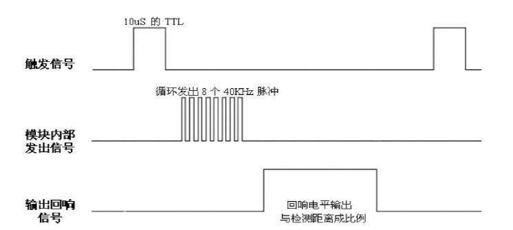

超声波时序图表明，我们只需要提供一个 10us 以上脉冲触发信号，HC-SR04 超声波模块内部将发出 8 个 40KHz 周期电平并检测回波。一旦检测到有回波信号输出回响信号。回响信号脉冲宽度与所测的距离成正比。由此通过发射信号到收到的回响信号时间间隔可以计算得到距离。公式：us/58=厘米 或者 us/148=英寸；或者 距离=高电平时间*声速（340M/S）/2。建议测量周期为 60ms 以上，以防止发射信号对回响信号的影响。

## 模块使用思路

初始化时，将 TRIG 和 ECHO 端口都置低，首先向给 TRIG 发送至少10us 的高电平脉冲（模块自动向外发送 8 个 40KHz 的方波），然后等待，捕捉 ECHO 端输出上升沿，捕捉到上升沿的同时，打开定时器开始计时，再次等待捕捉 ECHO 的下降沿，当捕捉到下降沿，读出计时器的时间，这就是超声波在空气中运行的时间，按照公式：测试距离=(高电平时间*声速)/2，就可以算出超声波到障碍物的距离。

捕捉上升沿和下降沿需要用到 STM32 的输入捕获功能。

## 输入捕获概念

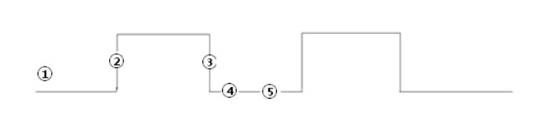

上面示意图用①②③④⑤进行了标注，分别对应：

① 先设置输入捕获为上升沿检测；

② 记录发生上升沿时TIMx_CNT(计数器)的值；

③ 配置捕获信号为下降沿捕获，当下降沿到来的时候发生捕获

④ 记录此时的TIMx_CN(计数器)T的值

⑤ 前后两次TIMx_CNT(计数器)的值之差就是高电平的脉宽。同时根据TIM的计数频率，我们就能知道高电平脉宽的准确时间。

简单说：当你设置的捕获开始的时候，cpu会将计数寄存器的值复制到捕获比较寄存器中并开始计数，当再次捕捉到电平变化时，这时计数寄存器中的值减去刚才复制的值就是这段电平的持续时间，你可以设置上升沿捕获、下降沿捕获、或者上升沿下降沿都捕获。

### 溢出时间计算

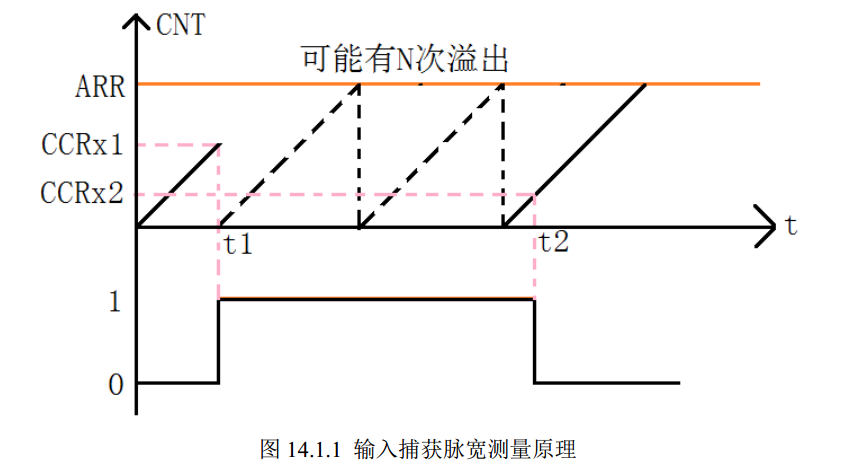

t1时刻检测到高电平，发生中断，在中断里将计数值置0，开始记溢出次数N，其中每计数0xFFFF次溢出一次，直到t2时刻跳变回低电平，获取最后一次溢出时到t2时刻的计数值TIM5CH1_CAPTURE_VAL则高电平时间 = 溢出次数\*65535+TIM5CH1_CAPTURE_VAL   us；根据定时器初始化时的频率即可计算出溢出总次数所占用的时间，即为高电平时间。如果计数器值为 32bit 那么最大为 0xFFFFFFFF  高电平时间：

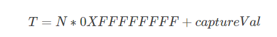

## 了解硬件

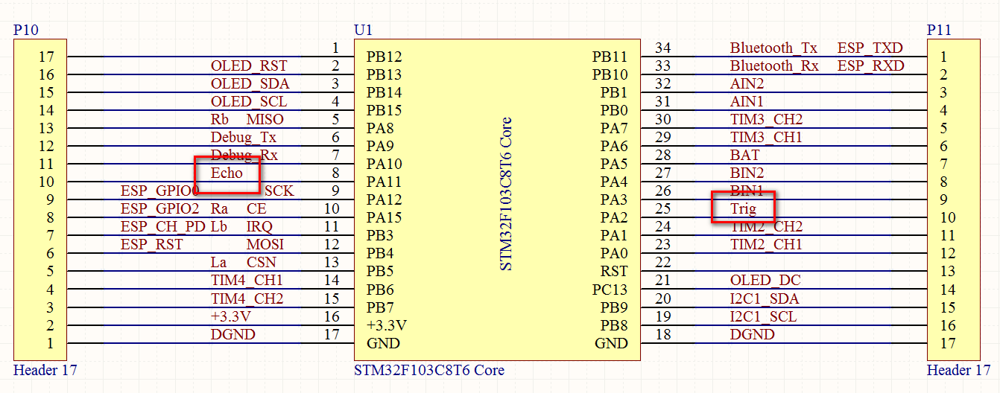

从我们的底板原理图可以得知，HC-SR04 超声波模块的 Echo 引脚连接 STM32 的 PA11 引脚，即 TIM1_CH4 用于输入捕获，Trig 引脚连接 STM32 的 PA2 引脚。

## STM32CubeMX配置

双击打开 MiaowLabs-Demo.ioc 工程，配置 PA2 引脚为 GPIO_Output 模式，并将 Maximum output speed 选为 High，User Label 改为 TRIG。如下图所示。

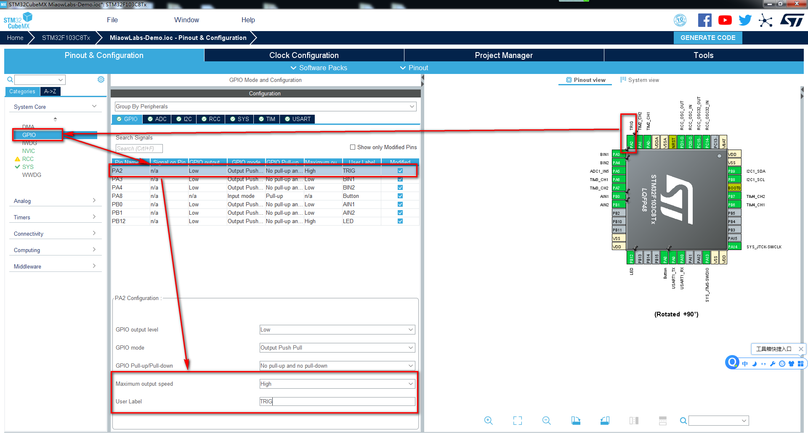

然后，配置高级定时器1（TIM1）CH4 通道。Clock Source 选择 Internal Clock，Channel4 配置为 Input Capture direct mode。在 Parameter Settings 中配置相关参数。如下图所示。

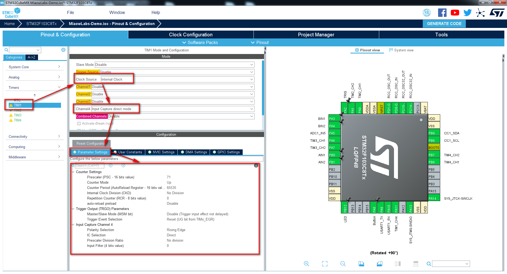

Prescaler 预分频系数设为 71，计数时钟频率就是 72MHz/(71+1) = 1MHz，Counter Mode 计数模式设为向上计数 Up，此时 1us 计数一次自动加载值设置为 16bits 最大值 0xFFFF。Polarity Selection 在这里预设为 Rising Edge 上升沿触发。

在 NVIC Settings 中，勾选 TIM1 update interrupt 和 TIM1 capture compare interrupt。如下图所示。

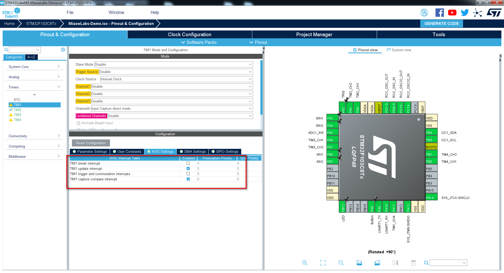

点击 GENERATE CODE 生成代码。

生成代码后，我们先在 main 函数中开启定时器

```c
HAL_TIM_IC_Start_IT(&htim1,TIM_CHANNEL_4);//开启TIM1的捕获通道4，并且开启捕获中断
__HAL_TIM_ENABLE_IT(&htim1,TIM_IT_UPDATE);//使能更新中断
```

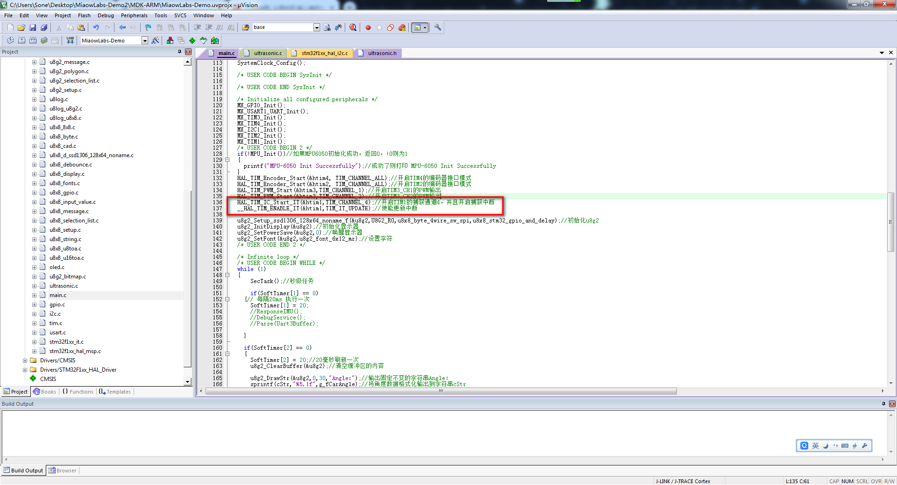

之后了解两个中断服务函数，第一个函数是输入捕获中断回调函数，当有变化沿的时候就会进入该函数。
```c
//定时器输入捕获中断处理回调函数，该函数在HAL_TIM_IRQHandler中会被调用
void HAL_TIM_IC_CaptureCallback(TIM_HandleTypeDef *htim)//捕获中断发生时执行
```
第二个函数是定时器的计数器计满一个周期触发的中断回调函数，也就是计数器从0到达0xffff的时候进入该函数。有两种情况会进入该函数，一种情况是定时器开启后在没有触发变化沿的时候也会在每次计数器值满的时候进入该中断；另一种情况是在上升沿触发后，高电平保持时间超过了计数器的周期而进入的中断，我们需要在这种情况下对进入中断的次数进行累加以算出高电平脉冲总时间。
```c
void HAL_TIM_PeriodElapsedCallback(TIM_HandleTypeDef *htim)
```

这两个中断服务函数在 stm32f1xx_hal_tim.c 中都被定义为弱函数（__weak），我们可以改写弱函数。

我们在 stm32f1xx_it.c 中，在 /* USER CODE BEGIN 1 */ 与  /* USER CODE END 1 */ 之间对这两个中断服务函数进行改写。

```c
/* USER CODE BEGIN 1 */

void HAL_TIM_IC_CaptureCallback(TIM_HandleTypeDef *htim)
{
	if(htim == &htim1)
	{
		if((TIM1CH4_CAPTURE_STA&0X80)==0)//还未成功捕获完整的高电平脉冲。（防止成功捕获了一次高电平脉冲后，还未等到main处理计算时间，又捕获到了一次变化沿。）
		{
			if(TIM1CH4_CAPTURE_STA&0X40)		//触发了变化沿，而之前已经有了上升沿，那么一定是下降沿，那么认为完整捕获了一次高电平持续时间 		
			{	  			
				TIM1CH4_CAPTURE_STA|=0X80;		//标记成功捕获到一次高电平脉宽
				TIM1CH4_CAPTURE_VAL=HAL_TIM_ReadCapturedValue(&htim1,TIM_CHANNEL_4);//获取当前的捕获值.
				TIM_RESET_CAPTUREPOLARITY(&htim1,TIM_CHANNEL_4);   //一定要先清除原来的设置！！
				TIM_SET_CAPTUREPOLARITY(&htim1,TIM_CHANNEL_4,TIM_ICPOLARITY_RISING);//配置TIM1通道4上升沿捕获
			}else  								//还未开始,第一次捕获上升沿
			{
				TIM1CH4_CAPTURE_STA=0;			//清空
				TIM1CH4_CAPTURE_VAL=0;
				TIM1CH4_CAPTURE_STA|=0X40;		//标记触发到了上升沿
				__HAL_TIM_DISABLE(&htim1);      //关闭定时器1，来重新配置定时器为捕获下降沿。等下次捕获到了下降沿的时候就是完整的高电平脉冲
				__HAL_TIM_SET_COUNTER(&htim1,0);
				TIM_RESET_CAPTUREPOLARITY(&htim1,TIM_CHANNEL_4);   //一定要先清除原来的设置！！
				TIM_SET_CAPTUREPOLARITY(&htim1,TIM_CHANNEL_4,TIM_ICPOLARITY_FALLING);//定时器1通道4设置为下降沿捕获
				__HAL_TIM_ENABLE(&htim1);		//使能定时器1
			}				
		}
	}

}

void HAL_TIM_PeriodElapsedCallback(TIM_HandleTypeDef *htim)
{
	if(htim == &htim1)
	{
		if((TIM1CH4_CAPTURE_STA&0X80)==0)//还未成功捕获
		{
			if(TIM1CH4_CAPTURE_STA&0X40)//已经到高电平了
			{
				if((TIM1CH4_CAPTURE_STA&0X3F)==0X3F)            //已经到了软件设计的最大高电平持续时间了，认为已经捕获了完整的高电平持续时间
				{
					TIM1CH4_CAPTURE_STA|=0X80;		//标记成功捕获了，其实这个时候并没有检测到下降沿
					TIM1CH4_CAPTURE_VAL=0XFFFF;
				}
				else 						//一般情况会到这个位置，让循环数+1
					TIM1CH4_CAPTURE_STA++;
			}	 
		}
	}
}
/* USER CODE END 1 */
```

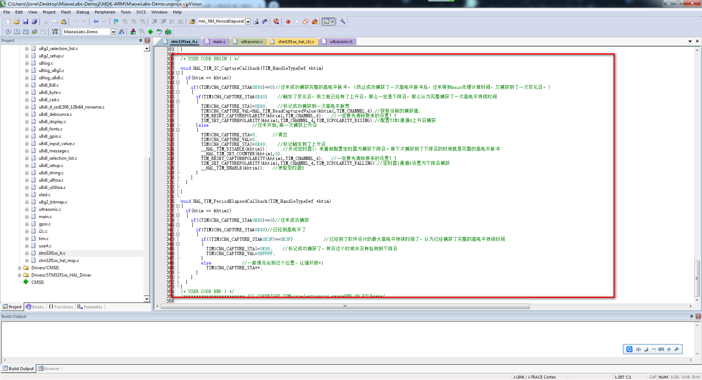

我们新建一个文件，命名为 ultrasonic.h，保存到工程 Inc 文件夹。并敲入以下代码：

```c
#ifndef __ULTRASONIC_H
#define __ULTRASONIC_H

extern int Distance;
extern int UltraError;
extern unsigned int TIM1CH4_CAPTURE_STA;
extern unsigned int TIM1CH4_CAPTURE_VAL;

void Read_Distane(void);
char InfraredDetect(void);
void UltraSelfCheck(void);
int IsUltraOK(void);

#endif
```

在 main.h 头文件中，加入 ultrasonic.h。

```c
/* USER CODE BEGIN Includes */
#include "button.h"
#include "encoder.h"
#include "mpu6050.h"
#include "control.h"
#include "outputdata.h"
#include <stdio.h>
#include "oled.h"
#include "ultrasonic.h"
/* USER CODE END Includes */
```

并在 /* USER CODE BEGIN ET */ 与 /* USER CODE END ET */ 之间预先声明一个软定时器函数。

```c
/* USER CODE BEGIN ET */
void SoftTimerCountDown(void);
/* USER CODE END ET */
```

我们新建一个文件，保存到工程的 Src 文件夹中，命名为 ultrasonic.c，记得要将该文件加入到工程的 Application/User 组中。


然后，敲入以下代码：

```c
#include "ultrasonic.h"
#include "tim.h"
#include "main.h"

unsigned int TIM1CH4_CAPTURE_STA;
//bit7:捕获完成标志 
//bit6：捕获到高点平标志
//bit5~0：捕获到高电平后定时器溢出的次数
unsigned int TIM1CH4_CAPTURE_VAL;

// 超声波检测距离，单位cm
int Distance = 0;
// 超声波自检标识，0--模块没插上，1--模块正常
int UltraError = 0;

/*
	触发一次超声波测距，并读取上次测量结果
*/
void Read_Distane(void)
{   
	 HAL_GPIO_WritePin(TRIG_GPIO_Port,TRIG_Pin,GPIO_PIN_SET);
	 HAL_Delay(1);  
	 HAL_GPIO_WritePin(TRIG_GPIO_Port,TRIG_Pin,GPIO_PIN_RESET);
	
	if(TIM1CH4_CAPTURE_STA&0X80)//成功捕获到了一次高电平
	{
		Distance = TIM1CH4_CAPTURE_STA&0X3F;
		Distance *= 65536;					 //溢出时间总和
		Distance += TIM1CH4_CAPTURE_VAL;		//得到总的高电平时间
		Distance = Distance*170/10000;//超声波测距是测量声波发出去和反射回来是时间间隔，用微妙做单位。
//空气中的声速是每秒340米。一微妙时间声波传输的距离是340×0.000001=0.00034米=0.034厘米，除以2就是所测距离:0.017=1.7/100。这就是1.7的来历。
		TIM1CH4_CAPTURE_STA=0;				//开启下一次捕获
	}				
}

/*
	模块自检，用于上电时检测超声波模块是否插上
*/
void UltraSelfCheck(void)
{
	HAL_Delay(1000);//新版超声波模块上电内部初始化要等1秒，先延时1秒
	
	if(!HAL_GPIO_ReadPin(GPIOA, GPIO_PIN_11)){//读ECHO引脚，看看有没有高电平信号
		HAL_Delay(50);
		if(!HAL_GPIO_ReadPin(GPIOA, GPIO_PIN_11))//再读ECHO引脚
			UltraError = 1;//1表示正常插上
	}
}

int IsUltraOK(void)
{
	return UltraError;
}
```

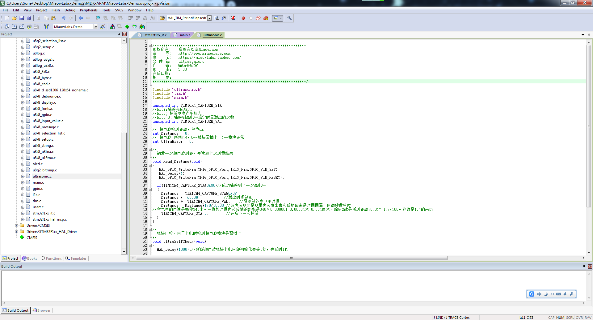

回到 main.c 源文件，在 /* USER CODE BEGIN 0 */ 与 /* USER CODE END 0 */ 之间进行函数定义。

```c
/* USER CODE BEGIN 0 */
// 系统软件定时器，分辨率为1ms，递减计数
unsigned short SoftTimer[5] = {0, 0, 0, 0, 0};

void SoftTimerCountDown(void)
{
	char i;
	for(i = 0;  i < 5; i++){
		if(SoftTimer[i] > 0)SoftTimer[i]--;
	}
}
//秒级任务
void SecTask()
{
	if(SoftTimer[0])return;
	else{
		SoftTimer[0] = 1000;
	}
}
/* USER CODE END 0 */
```

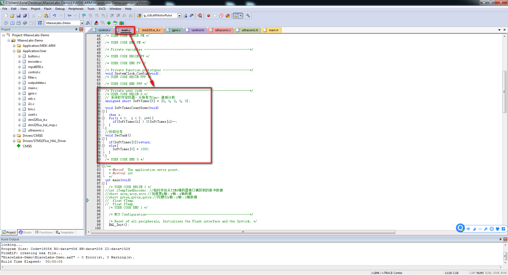

然后，在主循环里敲入以下代码：

```c
		while (1)
  {   
		SecTask();//秒级任务
		
	  if(SoftTimer[1] == 0)
		{// 每隔20ms 执行一次
			SoftTimer[1] = 20;
		}			
  	
		if(SoftTimer[2] == 0)
		{
			SoftTimer[2] = 20;//20毫秒刷新一次
			HAL_Delay(10);//延时一定要加的，避免读数过快
			Read_Distane();//每20ms读一次超声波数据
	        printf("检测距离 = %d\n",Distance);//把超声波检测距离打印出来
		}
  }
```

回到 stm32f1xx_it.c，找到 SysTick_Handler 中断服务函数。加入一句语句：

```c
SoftTimerCountDown();//软定时器计时函数
```

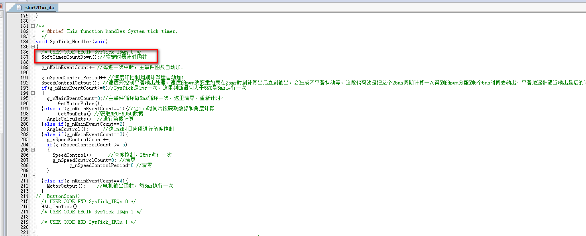

代码编写完成。点击编译，将代码进行编译，烧录到核心板上，装上电池，打开电源开关，再打开串口助手，可以看到串口助手上显示超声波检测距离的数据。

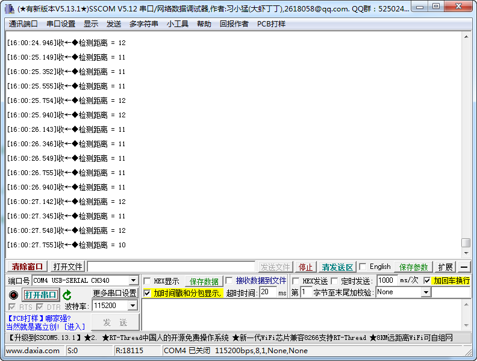

因为超声波模块用 5V 电压供电，而 USB 上的 5V 并没有直连到超声波上，所以接 USB 时，无法给超声波模块提供电压，必须装上小车电池，打开电源开关超声波模块才能正常工作。在调试超声波时，可以把底板这头的电机线拔出来，先单独静态调试超声波模块，免得小车运动造成调试困难。

### 注意事项

2. 测距时，被测物体的面积不少于 0.5 平方米且要尽量平整，否则会影响测试结果。  

