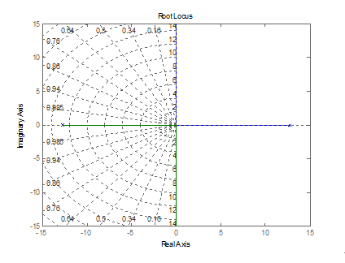
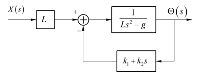
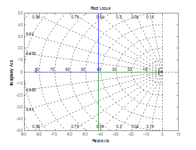

# 数学建模

在上面简单分析中，通过类比倒立摆得到了小车直立的控制方案。下面对两轮自平衡小车进行简单数学建模，然后建立速度的比例微分负反馈控制，根据基本控制理论讨论小车通过闭环控制保持稳定的条件。 

假设两轮自平衡小车简化成高度为$$L$$，质量为$$m$$的简单倒立摆，它放置在可以左右移动的车轮上。假设外力干扰引起小车产生角加速度 $$x(t)  $$。沿着垂直于小车底盘方向进行受力分析，可以得到车体倾角与车轮运动加速度 $$a (t) $$ 以及外力干扰加速度 $$x(t) $$ 之间的运动方程：  

对应小车静止时，系统输入输出的传递函数为：  

$$
H(s)= (\frac {\Theta (s}{\chi(s)})=\frac {1}{s^2-\frac{g}{L}})
$$

此时系统具有两个极点：

$$
s_p=\pm \sqrt \frac{g}{L}
$$

我们可以根据传递函数
$$
H(s)= (\frac {\Theta (s}{\chi(s)})=\frac {1}{s^2-\frac{g}{L}})
$$
，调用 Matlab 软件，绘制出传递函数的根轨迹示意图，如下图所示。

 

通过根轨迹示意图，可以很清晰的看出两轮自平衡小车的传递函数对应有两个零极点，有一个在 s 平面的右半平面。这说明两轮自平衡小车是不稳定的。

小车引入比例、微分（PD）反馈之后的系统如下图所示： 

系统传递函数为：
$$
H(s)= (\frac {\Theta (s}{\chi(s)})=\frac {1}{s^2+ \frac {k_2}{L}S+ \frac {k_1 -g}{L}})
$$
此时两个系统极点位于：
$$
s_p= (\frac {-k_2 \pm \sqrt (K^2 _2 -4l(K_1-G))}{2L})
$$

系统稳定需要两个极点都位于 s 平面的左半平面。要满足这一点，需要$$k_1>g$$，$$k_2>0$$。

我们调用 Matlab 软件绘制当前系统传递函数的根轨迹图，并且求解极点值。如下图所示。

通过根轨迹图可以清晰地看出，此时系统传递函数的极点都已经分布在了 s 平面的左半平面，只要参数适合，极点的位置将会进一步远离 0 点，系统将会更稳定。

由此可以得出结论，当 $$k_1>g$$，$$k_2>0$$ 时，两轮自平衡小车可以稳定。这与前面通过分析所得出的结论是一致的。