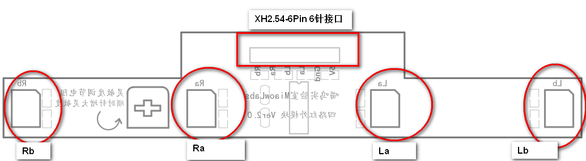
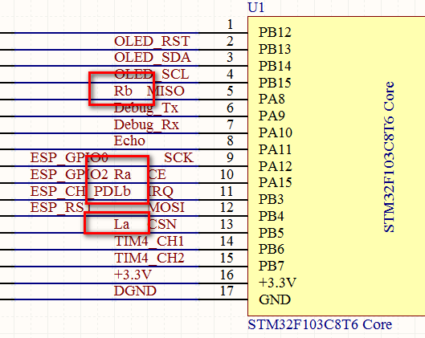
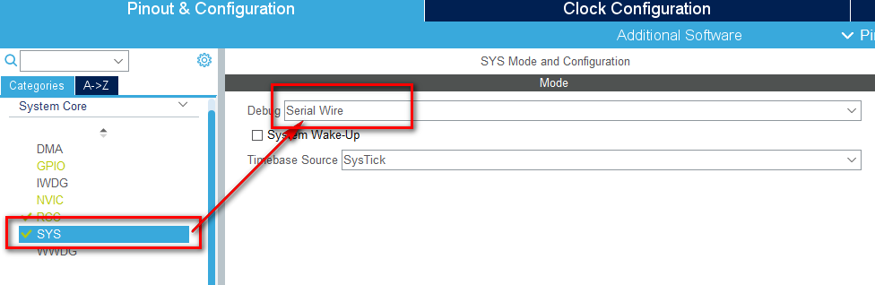
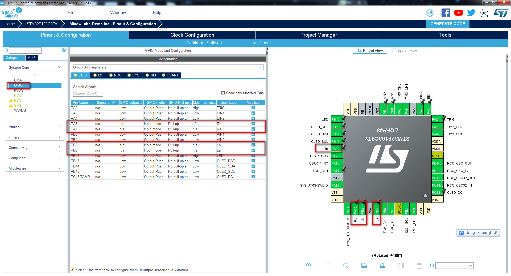

# 红外循迹模块

*本小节教你如何使用STM32CubeMX配置红外循迹模块，并使小车获得循迹功能。*

*本小节对应的实验例程为：MiaowLabs-Demo-21-nfrared*

## 产品参数

> * 工作电压：+5V
> * 工作电流：220mA±10mA；
> * 工作温度：-10°~ +50°
> *  安装孔径：M3
> * 检测距离：10mm 至 30mm 可调（调节临摹距离越远，精度越差，越容易误判）
> * 调节方法：按板子上的箭头方向调节可调电阻，检查距离变远，但精度变差。需要根据实际场地和离地距离调节可调电阻位置。
> * 模块接口：XH2.54-6P 接口（La、Lb、Ra、Rb 四路信号输出，Vcc 为电源 5V，Gnd 为电源地）
> * 输出信号：TTL 电平（可直接连接单片机 GPIO 引脚，传感器检测到反射回来的红外光时，相应的引脚输出低电平，否则输出高电平）
> * 备注：四路红外的每个红外都对应一个红色 LED 指示灯，检测到白底时 LED 亮，检测到黑线时 LED 不亮，用户可以参考 LED 来调节电阻。

## 接线说明

| 名称 | 说明                     |
| ---- | ------------------------ |
| Vcc  | 电源5V                   |
| Gnd  | 地                       |
| La   | 左 a 路红外 TTL 电平输出 |
| Lb   | 左 b 路红外 TTL 电平输出 |
| Ra   | 右 a 路红外 TTL 电平输出 |
| Rb   | 右 b 路红外 TTL 电平输出 |

## 工作原理

黑线的检测原理是红外发射管发射光线到路面，红外光遇到白底则被反射，接收管接收到反射光内，经施密特触发器整形后输出低电平；当红外光遇到黑线时则被吸收，接收管没有接收到反射光，经施密特触发器整形容后输出高电平。

# STM32CubeMX 配置

从原理图中可以看到，四路红外模块的 Ra、Rb、La、Lb 引脚分别连接 STM32 的 PA15、PA8、PB5、PB3 引脚。由于红外模块是反馈高低电平（检测到黑线输出低电平为 0，反之输出高电平为 1），我们只要设置引脚为 GPIO，读取到红外实时电平，就能判断线在哪一边。

先双击 MiaowLabs-Demo.ioc 文件，打开 STM32CubeMX 工程。如果之前我们在 SYS 的 DEBUG （仿真）选项中选择了 JTAG(4 PIN )，那么 PA15 就会被占用了。 在这里，我们需要把 PA15 分配给红外使用，而核心板中只是预留了 SWD 接口，所以把 DEBUG （仿真）选项中设为  Serial Wire 就可以了。

接着，把 PA15、PA8、PB5、PB3 这四个引脚设置为 GPIO_Input 模式，并分别命名为 Ra、Rb、La、Lb，同时设置为上拉模式 Pull-up。如下图所示。

