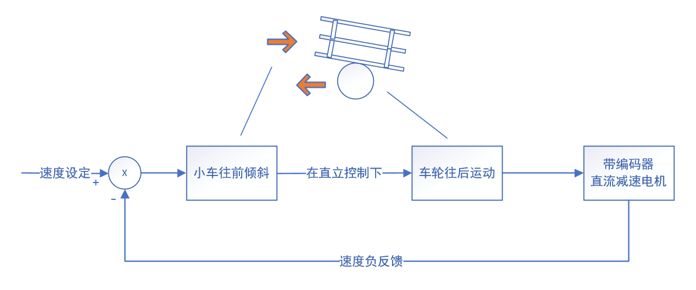
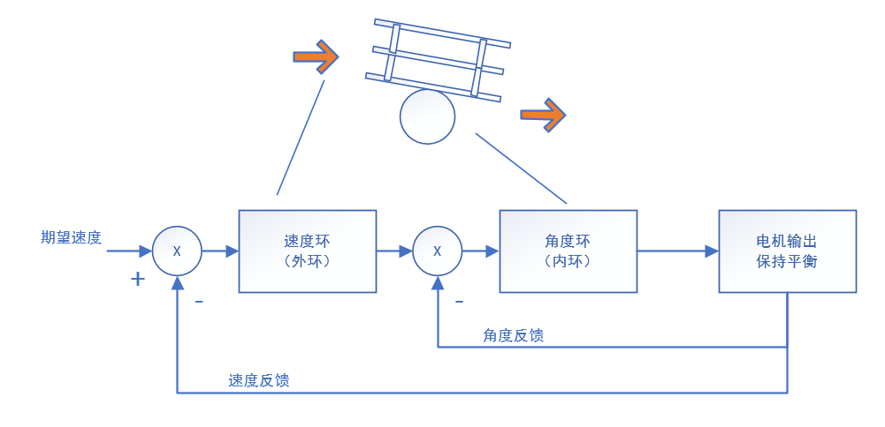
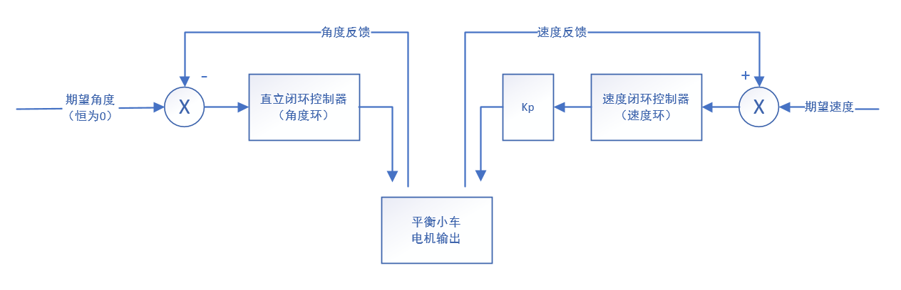

# 自平衡小车速度控制原理与串级PID

通常在三轮小车、四轮小车中，我们使用 PID 进行速度控制，大部分都是负反馈。但是两轮自平衡小车的速度控制不大一样，不是负反馈，而是正反馈，因为小车的两个电机需要进行直立控制的同时去进行速度控制。

我们先使用常规的速度负反馈算法试一下，看在平衡小车上面是否有效果。首先我们给定一个目标速度值，由于在直立控制的作用下，此时小车要向前倾斜以获取加速度，车轮需要往后运动，这样小车的速度就会下降。因为是负反馈，速度下降之后，速度控制的偏差增大，小车往前倾斜的角度增大，如此反复，小车便会倒下。常规的速度负反馈在直立控制的影响下起到了正反馈效果。如下图所示。



根据以上的分析，在直立控制里面加入速度负反馈无法达到速度闭环的目的，而且还会破坏直立控制系统。下面我们换一种思路。

为保证直立控制的优先级，我们把速度控制放在直立控制的前面，也就是速度控制调节的结果仅仅是改变直立控制的目标值。因为根据经验可知，小车的运行速度和小车的倾角是相关的。比如要提高小车向前行驶的速度，就需要增加小车向前倾斜的角度，倾斜角度加大之后，车轮在直立控制的作用下需要向前运动保持小车平衡，速度增大；如果要降低小车向前行驶的速度，就需要减小小车向前的倾斜角度，倾斜角度减小之后，车轮在直立控制的作用下向后运动保持小车平衡，速度减小。如下图所示。



根据上面的原理图，我们把速度和直立两个控制器串联起来工作，其中速度控制的输出作为直立控制的输入，而直立控制的输出作为系统的输出，这其实就是一个串级控制系统。直立控制在前面有介绍，使用的 PD 控制。因为编码器可能存在的噪声，为防止噪声被放大并消除系统的静差，这里我们速度控制使用 PI 控制。


$$
\alpha = kp*(\theta - \alpha_1)+kd*\theta^1 \quad (1)
$$

$$
\alpha_1 = kp_1*e(k)+ki_1*\sum e(k) \quad (2)
$$


式（1）为直立控制算法，式（2）为速度控制算法。$$\theta$$ 是角度，$$\theta^1$$是角速度，$$e(k)$$ 是速度控制偏差、$$\sum e(k)$$是速度控制偏差的积分。为了方便我们后面的 PID 参数的整定，可以对控制系统做进一步的简化。和并式（1）和式（2）得到式（3）


$$
\alpha = kp*\theta+kd*\theta^1-Kp*[Kp_1*e(k)+ki_1\sum e(k)] \quad (3)
$$


至此，我们得到了让小车保持直立且速度为给定值的控制算法，由一个负反馈的直立 PD 控制器和一个正反馈的速度 PI 控制器组成。控制原理图进行的演变，如下图所示。



因为常规的速度控制都是负反馈，为了验证在这里的速度控制器确实是正反馈，我们可以做一个小实验。首先把式（3）中直立控制部分屏蔽，只留下速度控制部分，得到式（4）。


$$
\alpha = -Kp*[Kp_1*e(k)+ki_1\sum e(k)] \quad (4)
$$


在代码中屏蔽直立控制和转向控制，可以直接在电机输出函数中进行屏蔽。

```c
void MotorOutput(void)
{
    //这里的电机输出等于角度环控制量 + 速度环外环,这里的 - g_fSpeedControlOut 是为了表明速度环的极性跟角度环不一样，角度环是负反馈，速度环是正反馈
    //直接在电机输出函数中只保留速度控制。其他控制不叠加，进行屏蔽。
    g_fLeftMotorOut  = - g_fSpeedControlOut ;
	g_fRightMotorOut = - g_fSpeedControlOut ;
	//g_fLeftMotorOut  = g_fAngleControlOut - g_fSpeedControlOut - g_fBluetoothDirection ;
	//g_fRightMotorOut = g_fAngleControlOut - g_fSpeedControlOut + g_fBluetoothDirection ;


	/*增加死区常数*/
	if((int)g_fLeftMotorOut>0)       g_fLeftMotorOut  += MOTOR_OUT_DEAD_VAL;
	else if((int)g_fLeftMotorOut<0)  g_fLeftMotorOut  -= MOTOR_OUT_DEAD_VAL;
	if((int)g_fRightMotorOut>0)      g_fRightMotorOut += MOTOR_OUT_DEAD_VAL;
	else if((int)g_fRightMotorOut<0) g_fRightMotorOut -= MOTOR_OUT_DEAD_VAL;

	/*输出饱和处理，防止超出PWM范围*/			
	if((int)g_fLeftMotorOut  > MOTOR_OUT_MAX)	g_fLeftMotorOut  = MOTOR_OUT_MAX;
	if((int)g_fLeftMotorOut  < MOTOR_OUT_MIN)	g_fLeftMotorOut  = MOTOR_OUT_MIN;
	if((int)g_fRightMotorOut > MOTOR_OUT_MAX)	g_fRightMotorOut = MOTOR_OUT_MAX;
	if((int)g_fRightMotorOut < MOTOR_OUT_MIN)	g_fRightMotorOut = MOTOR_OUT_MIN;
	
    SetMotorVoltageAndDirection((int)g_fLeftMotorOut,(int)g_fRightMotorOut);
}
```

我们直接在小车上进行算法验证。使用一款调试好的小车，屏蔽程序中的直立控制和转向控制，在车轮悬空的时候给它一个干扰（就是用手给它拨一下），可以看到车轮在受干扰之后沿相同的转动方向不断增大，直到饱和。这是典型的正反馈现象。最终，速度控制的偏差经过积分和比例直接叠加在电机控制量上。速度控制在刚开始讨论的时候是通过调节小车倾角来实现，通过上面的简化和改进，最后已经演变成对电机的直接控制了。

虽然最后我们没有直接使用串级控制系统，但是经过我们的实验，直接串级 PID 对两轮自平衡小车的直立和速度进行控制也是可以的，并且，在串级 PID 控制系统里面，速度控制是负反馈（详见第二张控制图）。