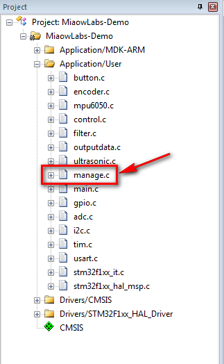

# 添加超声波避障模式

在上一小节中，我们已经成功驱动超声波模块，并测到前方障碍物的距离。我们可以进一步利用超声波模块，编写相关避障算法，使小车在探测到前方障碍物时自动转向。

新建一个文件，保存到工程的 Src 文件夹中，命名为 manage.c，记得要将该文件加入到工程的 Application/User 组中。



敲入以下代码：

```c
#include "manage.h"

const char FirmwareVer[] = "3.33";
const char EEPROMVer[]  = "2.00";
const char MCUVer[] = "STM32F103C8T6";

//系统运行时间计数，，开机后开始计数，每秒增1
unsigned short  g_RunTime = 0;

//电池电压，实际值*100
unsigned short  g_BatVolt=0;

//小车运行模式:遥控模式、红外寻迹模式，超声波避障、超声波跟随模式
unsigned char g_CarRunningMode = ULTRA_AVOID_MODE;//默认模式

//以下定义在manage.h中
//#define CONTROL_MODE 			1   遥控模式
//#define INFRARED_TRACE_MODE 	2    红外寻迹模式
//#define ULTRA_FOLLOW_MODE		3       超声波跟随模式
//#define ULTRA_AVOID_MODE	   4      超声波避障模式

```

接着，新建一个头文件，保存到工程的 inc 文件夹中，命名为 manage.h。

敲入以下代码：

```c
#ifndef _MANAGE_H
#define _MANAGE_H

#define CONTROL_MODE 			1
#define INFRARED_TRACE_MODE 	2
#define ULTRA_FOLLOW_MODE		3
#define ULTRA_AVOID_MODE	   4

extern const char FirmwareVer[];
extern const char EEPROMVer[];
extern const char MCUVer[];

extern unsigned short  g_RunTime;
extern unsigned short g_BatVolt;
extern unsigned char   g_CarRunningMode;


#endif

```

回到 control.c 源文件中，在开头变量定义中，添加以下三个变量：

```c
float g_fBluetoothDirection;
int g_iLeftTurnRoundCnt = 0;
int g_iRightTurnRoundCnt = 0;
```

在 void GetMotorPulse(void)函数中，进行改造代码：

```c
void GetMotorPulse(void)//读取电机脉冲
{
	g_nRightMotorPulse = (short)(__HAL_TIM_GET_COUNTER(&htim4));//获取计数器值
    g_nRightMotorPulse = (-g_nRightMotorPulse);
	__HAL_TIM_SET_COUNTER(&htim4,0);//TIM4计数器清零
	g_nLeftMotorPulse = (short)(__HAL_TIM_GET_COUNTER(&htim2));//获取计数器值
	__HAL_TIM_SET_COUNTER(&htim2,0);//TIM2计数器清零
	
    g_lLeftMotorPulseSigma += g_nLeftMotorPulse;//速度外环使用的脉冲累积
    g_lRightMotorPulseSigma += g_nRightMotorPulse;//速度外环使用的脉冲累积
	
	g_iLeftTurnRoundCnt -= g_nLeftMotorPulse;
	g_iRightTurnRoundCnt -= g_nRightMotorPulse;
}
```

在 void MotorOutput(void) 函数中，同样进行改造：

```c
void MotorOutput(void)//电机输出函数,将直立控制、速度控制、方向控制的输出量进行叠加,并加入死区常量，对输出饱和作出处理。
{
    
	g_fLeftMotorOut  = g_fAngleControlOut - g_fSpeedControlOut - g_fBluetoothDirection ;	//这里的电机输出等于角度环控制量 + 速度环外环,这里的 - g_fSpeedControlOut 是因为速度环的极性跟角度环不一样，角度环是负反馈，速度环是正反馈
	g_fRightMotorOut = g_fAngleControlOut - g_fSpeedControlOut + g_fBluetoothDirection ;

	/*增加电机死区常数*/
	if((int)g_fLeftMotorOut>0)       g_fLeftMotorOut  += MOTOR_OUT_DEAD_VAL;
	else if((int)g_fLeftMotorOut<0)  g_fLeftMotorOut  -= MOTOR_OUT_DEAD_VAL;
	if((int)g_fRightMotorOut>0)      g_fRightMotorOut += MOTOR_OUT_DEAD_VAL;
	else if((int)g_fRightMotorOut<0) g_fRightMotorOut -= MOTOR_OUT_DEAD_VAL;

	/*输出饱和处理，防止超出PWM范围*/			
	if((int)g_fLeftMotorOut  > MOTOR_OUT_MAX)	g_fLeftMotorOut  = MOTOR_OUT_MAX;
	if((int)g_fLeftMotorOut  < MOTOR_OUT_MIN)	g_fLeftMotorOut  = MOTOR_OUT_MIN;
	if((int)g_fRightMotorOut > MOTOR_OUT_MAX)	g_fRightMotorOut = MOTOR_OUT_MAX;
	if((int)g_fRightMotorOut < MOTOR_OUT_MIN)	g_fRightMotorOut = MOTOR_OUT_MIN;
	
    SetMotorVoltageAndDirection((int)g_fLeftMotorOut,(int)g_fRightMotorOut);
}

```

添加量程处理函数Scale()和遥控速度及方向处理函数Steer()，还有超声波相关函数UltraControl()，如下图所示：

```c
/***************************************************************
** 函数名称: Scale
** 功能描述: 量程处理
** 输　入:   
** 输　出:   
** 全局变量: 
** 作　者:   喵呜实验室MiaowLabs
** 淘  宝：  https://miaowlabs.taobao.com/
** 日　期:   2014年08月01日
***************************************************************/
float Scale(float input, float inputMin, float inputMax, float outputMin, float outputMax) { 
  float output;
  if (inputMin < inputMax)
    output = (input - inputMin) / ((inputMax - inputMin) / (outputMax - outputMin));
  else
    output = (inputMin - input) / ((inputMin - inputMax) / (outputMax - outputMin));
  if (output > outputMax)
    output = outputMax;
  else if (output < outputMin)
    output = outputMin;
  return output;
}


/***************************************************************
** 函数名称: Steer
** 功能描述: 遥控速度及方向处理函数
** 输　入:   
** 输　出:   
** 全局变量: 
** 作　者:   喵呜实验室MiaowLabs
** 淘  宝：  https://miaowlabs.taobao.com/
** 日　期:   2014年08月01日
***************************************************************/
void Steer(float direct, float speed)
{
	if(direct > 0)
		g_fBluetoothDirection = Scale(direct, 0, 10, 0, 400);
	else
		g_fBluetoothDirection = -Scale(direct, 0, -10, 0, 400);

	if(speed > 0)
		g_iCarSpeedSet = Scale(speed, 0, 10, 0, 70);
	else
		g_iCarSpeedSet = -Scale(speed, 0, -10, 0, 70);

}

/***************************************************************
** 作　  者: Songyibiao
** 官    网：http://www.miaowlabs.com
** 淘    宝：https://miaowlabs.taobao.com/
** 日　  期: 20160415
** 函数名称: UltraControl
** 功能描述: 超声波跟随/避障           
** 输　  入:   
** 输　  出:   
** 备    注: 
********************喵呜实验室MiaowLabs版权所有**************************/
void UltraControl(int mode)
{
	if(mode == 0)//跟随模式
	{
		if((Distance >= 0) && (Distance<= 12))
		{//距离小于12cm则后退
			Steer(0, -4);
		}
		else if((Distance> 18) && (Distance<= 30))	
		{//距离大于18cm且小于30则前进
			Steer(0, 4);
		}
		else
			Steer(0, 0);
	}
	else if(mode == 1)//避障模式
	{
		if((Distance >= 0) && (Distance<= 15))//这里设置成探测到障碍物距离为0到15cm，就右转避开
		{
			Steer(5, 0);
			g_iLeftTurnRoundCnt = 500;//右转550个脉冲计数，转弯角度约为90度，这个数值根据实际转向情况调节
			g_iRightTurnRoundCnt = -500;//同上
		}
		if((g_iLeftTurnRoundCnt < 0)&&(g_iRightTurnRoundCnt > 0))
		{
			Steer(0, 4);
		}
	}
}
```

在main.h中添加manage.h头文件，如下图所示。


在main.c函数中添加相关代码：

```c
 if(!MPU_Init())//如果MPU6050初始化成功，返回0，!0则为1
  {
		printf("MPU-6050 Init Successfully");//成功了则打印 MPU-6050 Init Successfully
	}
	HAL_TIM_Encoder_Start(&htim4, TIM_CHANNEL_ALL);//开启TIM4的编码器接口模式
	HAL_TIM_Encoder_Start(&htim2, TIM_CHANNEL_ALL);//开启TIM2的编码器接口模式
	HAL_TIM_PWM_Start(&htim3,TIM_CHANNEL_1);//开启TIM3_CH1的PWM输出
	HAL_TIM_PWM_Start(&htim3,TIM_CHANNEL_2);//开启TIM3_CH2的PWM输出
	HAL_ADC_Start(&hadc1);// 启动ADC转换
	HAL_TIM_IC_Start_IT(&htim1,TIM_CHANNEL_4);//开启TIM1的捕获通道4，并且开启捕获中断
  __HAL_TIM_ENABLE_IT(&htim1,TIM_IT_UPDATE);//使能更新中断
	UltraSelfCheck();//超声波模块自检
  /* USER CODE END 2 */

  /* Infinite loop */
  /* USER CODE BEGIN WHILE */
  while (1)
  { 
		SecTask();//秒级任务
		
	  if(SoftTimer[1] == 0)
		{// 每隔20ms 执行一次
			SoftTimer[1] = 20;
		}			
  	
		if(SoftTimer[2] == 0)
		{
			SoftTimer[2] = 20;//20毫秒刷新一次
			//HAL_Delay(10);//延时，避免读数过快
			Read_Distane();//每20ms读一次超声波数据
	    //printf("检测距离 = %d\n",Distance);//把超声波检测距离打印出来
		}
		if(g_CarRunningMode == ULTRA_FOLLOW_MODE){
				if(IsUltraOK())UltraControl(0);	//超声波跟随模式
	 		} else if(g_CarRunningMode == ULTRA_AVOID_MODE){
				if(IsUltraOK())UltraControl(1);	//超声波避障模式
	 		}
  }
```


至此，代码添加完毕。

重新编译代码，然后烧录进小车内。把小车放到空旷地面，扶正，开机，当小车前行时，用手掌在前方15cm内阻挡超声波，可以看到小车自动右转避开。