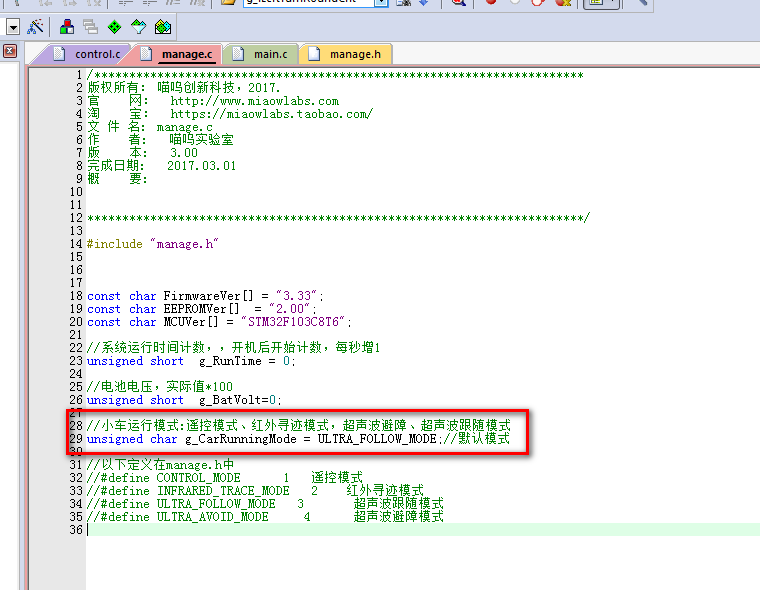

# 添加超声波跟随功能

通过上两小节的学习，我们学到了如何使用超声波探测前方障碍物距离，和添加超声波避障相关算法代码。

因为我们在上一小节已经把超声波避障和跟随的代码都写好了，在这小节中，我们只需要把开机模式设成跟随就可以了。

我们打开 manage.c 源文件，然后把开机模式从超声波避障模式改成跟随模式就可以了。

```c
unsigned char g_CarRunningMode = ULTRA_AVOID_MODE;//超声波避障模式
```

改成

```c
unsigned char g_CarRunningMode = ULTRA_FOLLOW_MODE;//超声波跟随模式
```

如下图所示：



修改好后，重新编译代码，下载到小车里，放在空旷地面，扶正车体，开机，把手放在超声波模块前，可以看到小车在探测到手掌距离小于12cm时会后退，当探测到手掌距离大于18cm且小于30cm时会跟随手掌前进。

