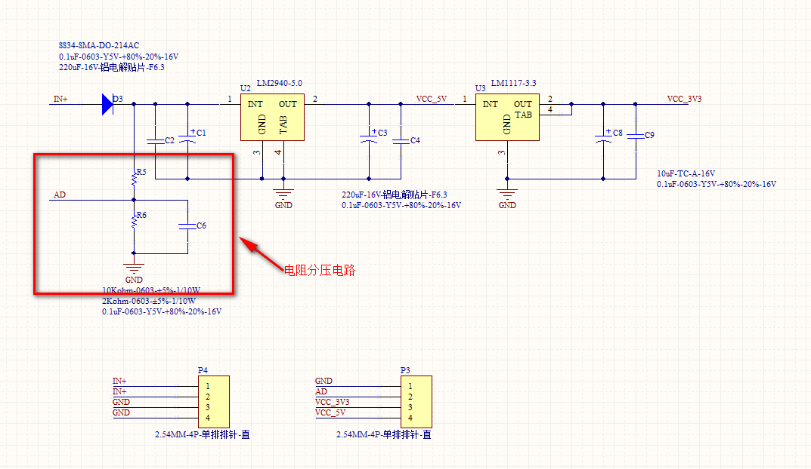

# 稳压模块

> *本小节对稳压模块进行说明。*  

系统的动力来源为两节 18650 动力锂电池，每节电池额定电压 3.7v（充满电压 4.2v），两节电池串联得到的 7.4v（充满电压 8.4v）。但是，电路中常用的电压为 5v 和 3.3v，所以，我们并不能直接把电池电压供给电路模块，而是需要对 7.4v 进一步降压稳压，分别降压至 5v 和 3.3v，以供整个电路系统使用。

我们自制了一块降压稳压模块，板载 LM2940-5.0、LM1117-3.3 两款低压差线性稳压芯片（LDO），两者的最大输出电流分别为 1000mA、800mA，不俗的输出电流能够满足小车的正常工作，并且还能给后续的扩展预留了电流余量。另外，LM2940-5.0、LM1117-3.3 两款 LDO 芯片工作效率高、输出电压纹波比 DC/DC 芯片小得多。

为了能实时监测输入电压的变化情况（即电池电压，电池电压表征电池容量），我们在稳压降压模块中加入一个电阻分压检测电路，使用 STM32 的 ADC 引脚采集到分压电阻的电压值，然后再进行转换运算，就能得到电池的电量状况，并在算法中调整参数对应电压的变化。

 
