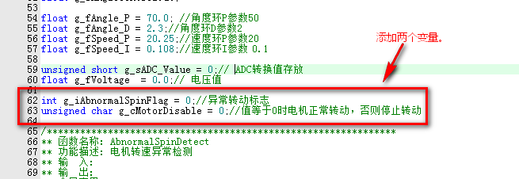
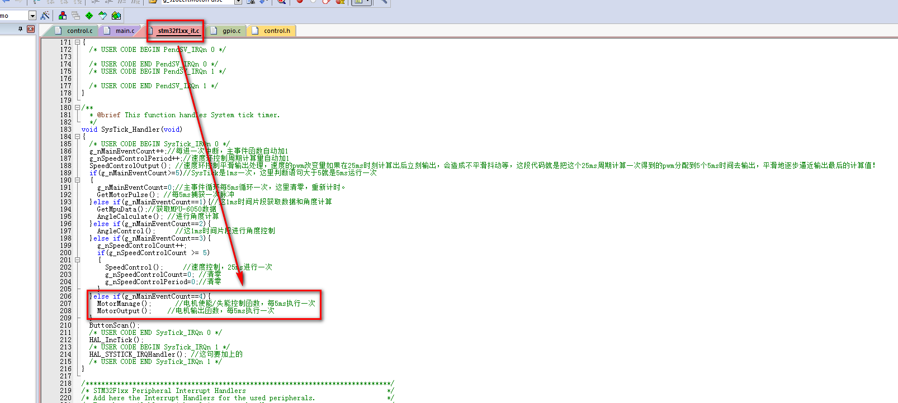

# 添加提起/着陆识别

> *本小节继续教你添加提起识别和着陆识别算法代码。*

打开上一小节的 MiaowLabs-Demo 工程，在左侧项目栏的`Application/User`文件夹中找到`control.c`，双击打开该文件。

添加两个变量，并初始化为 0。

```c
int g_iAbnormalSpinFlag = 0;//异常转动标志
unsigned char g_cMotorDisable = 0;//值等于0时电机正常转动，否则停止转动
```



添加以下三个函数。

```c
/***************************************************************
** 函数名称: AbnormalSpinDetect
** 功能描述: 小车提起识别/电机转速异常检测      
** 输　入:   
** 输　出:   
** 全局变量: 
** 作　者:   喵呜实验室MiaowLabs
** 日　期:   
***************************************************************/

void AbnormalSpinDetect(short leftSpeed,short rightSpeed)
{
	static unsigned short count = 0;
	
	//速度设置为0时检测，否则不检测
	if(g_iCarSpeedSet==0)
	{
		if(((leftSpeed>30)&&(rightSpeed>30)&&(g_fCarAngle > -30) && (g_fCarAngle < 30))||(((leftSpeed<-30)&&(rightSpeed<-30))&&(g_fCarAngle > -30)&&(g_fCarAngle < 30)))
		{// 左右电机转速大于30、方向相同、持续时间超过250ms，且车身角度不超过30度，则判断为悬空空转
			count++;
			if(count>50){
				count = 0;
				g_iAbnormalSpinFlag = 1;
			}
		}
		else{
			count = 0;
		}
	}
	else{
		count = 0;
	}
}


/***************************************************************
** 函数名称: LandingDetect
** 功能描述: 小车着地检测      
** 输　入:   
** 输　出:   
** 全局变量: 
** 作　者:   喵呜实验室MiaowLabs
** 日　期:  
***************************************************************/
void LandingDetect(void)
{
	static float lastCarAngle = 0;
	static unsigned short count = 0,count1 = 0;
	
	if(g_iAbnormalSpinFlag == 0)return;
	
	// 小车角度5°~-5°启动检测
	if((g_fCarAngle > -5) && (g_fCarAngle < 5))
	{
		count1++;
		if(count1 >= 50)
		{//每隔250ms判断一次小车角度变化量，变化量小于0.8°或大于-0.8°判断为小车静止
			count1 = 0;
			if(((g_fCarAngle - lastCarAngle) < 0.8) && ((g_fCarAngle - lastCarAngle) > -0.8))
			{
				count++;
				if(count >= 4){
					count = 0;
					count1 = 0;
					g_fCarPosition = 0;
					g_iAbnormalSpinFlag = 0;
				}
			}
			else{
				count = 0;
			}
			lastCarAngle = g_fCarAngle;
		}
	}
	else
	{
		count1 = 0;
		count = 0;
	}
}


/***************************************************************
** 函数名称: MotorManage
** 功能描述: 电机使能/失能控制      
** 输　入:   
** 输　出:   
** 全局变量: 
** 作　者:   喵呜实验室MiaowLabs
** 日　期:   
***************************************************************/
void MotorManage(void)
{

	AbnormalSpinDetect(g_nLeftMotorPulse, g_nRightMotorPulse);
		
	LandingDetect();
	
	if(g_iAbnormalSpinFlag)//如果异常转动标志为1
	{	
		g_cMotorDisable |= (0x01<<1);//置1，无符号数0x01写成2进制是00000001，左移动1变为00000010，用变量中的1位中的0或1对应电机是否被禁用，第1位置1代表是异常转动要失能电机
	}
	else
	{
		g_cMotorDisable &= ~(0x01<<1);//置0
	}
	
	if(g_fCarAngle > 30 || g_fCarAngle < (-30))/如果角度超过设定值
	{
		g_cMotorDisable |= (0x01<<2);//用变量中的2位中的0或1对应电机是否被禁用，第2位置1代表是角度倾斜异常要失能电机
	}
	else
	{
		g_cMotorDisable &= ~(0x01<<2);//置0
	}
	
}
```

其中，`AbnormalSpinDetect(short leftSpeed,short rightSpeed)`函数有两个输入量，分别为左右轮子的速度。在函数里设置了一个条件判断，当速度为 0 时，才继续往下运行，不然就跳出函数。因为当你在遥控或者循迹等操作时，小车原则上都是在地面运行中的，运行中速度一般不为 0。然后通过转速、角度、持续时间三个条件来判断小车是否被提起，是的话则将异常转动标志`g_iAbnormalSpinFlag`置 1，小车停止转动。

`LandingDetect(void)`函数通过判断车身角度和角度变化量来判断是否被放下地面。因此，在将小车放回地面时，需要扶正小车，保持 3 秒，小车才会启动车轮转动，恢复平衡。

`MotorManage(void)`函数主要的作用就是通过判断异常转动标志`g_iAbnormalSpinFlag`和角度`g_fCarAngle`，给电机失能标志`g_cMotorDisable`对应的位数赋值。这里用电机失能标志`g_cMotorDisable`不同的位数来装载不同原因导致的异常值，以便后续如果有查找异常原因，则可以快速找到原因。

然后，修改 SetMotorVoltageAndDirection(int nLeftMotorPwm,int nRightMotorPwm) 函数。

```c
void SetMotorVoltageAndDirection(int nLeftMotorPwm,int nRightMotorPwm)//设置电机电压和方向
{
	if(nRightMotorPwm < 0)//反转
		{
			HAL_GPIO_WritePin(AIN1_GPIO_Port, AIN1_Pin, GPIO_PIN_SET);
			HAL_GPIO_WritePin(AIN2_GPIO_Port, AIN2_Pin, GPIO_PIN_RESET);
			nRightMotorPwm = (-nRightMotorPwm);//如果计算值是负值，负值只是表示反转，先转负为正，因为PWM寄存器只能是正值
		}else//正转
		{
			HAL_GPIO_WritePin(AIN1_GPIO_Port, AIN1_Pin, GPIO_PIN_RESET);
			HAL_GPIO_WritePin(AIN2_GPIO_Port, AIN2_Pin, GPIO_PIN_SET);
		}
	if(nLeftMotorPwm < 0)//反转
		{
			HAL_GPIO_WritePin(BIN1_GPIO_Port, BIN1_Pin, GPIO_PIN_SET);
			HAL_GPIO_WritePin(BIN2_GPIO_Port, BIN2_Pin, GPIO_PIN_RESET);
			nLeftMotorPwm = (-nLeftMotorPwm);//如果计算值是负值，负值只是表示反转，先转负为正，因为PWM寄存器只能是正值
		}else//正转
		{
			HAL_GPIO_WritePin(BIN1_GPIO_Port, BIN1_Pin, GPIO_PIN_RESET);
			HAL_GPIO_WritePin(BIN2_GPIO_Port, BIN2_Pin, GPIO_PIN_SET);
		}
		
		if(nRightMotorPwm > MOTOR_OUT_MAX) nRightMotorPwm = MOTOR_OUT_MAX;//防止计算值超出寄存器量程
		if(nLeftMotorPwm  > MOTOR_OUT_MAX)  nLeftMotorPwm = MOTOR_OUT_MAX;//防止计算值超出寄存器量程
		
		if(g_cMotorDisable)//如果电机停止转动标志为1,则停止转动，否则正常输出PWM
	 {
	  	__HAL_TIM_SET_COMPARE(&htim3, TIM_CHANNEL_1, 0);//给PWM寄存器赋值
		  __HAL_TIM_SET_COMPARE(&htim3, TIM_CHANNEL_2, 0); //给PWM寄存器赋值
	 }
	 else //否则正常输出PWM
	 {
		  __HAL_TIM_SET_COMPARE(&htim3, TIM_CHANNEL_1, nRightMotorPwm);//给PWM寄存器赋值
		  __HAL_TIM_SET_COMPARE(&htim3, TIM_CHANNEL_2, nLeftMotorPwm); //给PWM寄存器赋值
	 }
		
		
}
```

最后，打开 `stm32f1xx_it.c`源文件，找到滴答定时器中断服务函数 `SysTick_Handler(void)`，在里面加入 `MotorManage(void)` 函数。

```c
void SysTick_Handler(void)
{
  /* USER CODE BEGIN SysTick_IRQn 0 */
  g_nMainEventCount++;//每进一次中断，主事件函数自动加1
  g_nSpeedControlPeriod++;//速度环控制周期计算量自动加1
	SpeedControlOutput(); //速度环控制平滑输出处理，速度的pwm改变量如果在25ms时刻计算出后立刻输出，会造成不平滑抖动等，这段代码就是把这个25ms周期计算一次得到的pwm分配到5个5ms时间去输出，平滑地逐步逼近输出最后的计算值！ 
  if(g_nMainEventCount>=5)//SysTick是1ms一次，这里判断语句大于5就是5ms运行一次
	{
		g_nMainEventCount=0;//主事件循环每5ms循环一次，这里清零，重新计时。
    GetMotorPulse(); //每5ms捕获一次脉冲
	}else if(g_nMainEventCount==1){//这1ms时间片段获取数据和角度计算
    GetMpuData();//获取MPU-6050数据
		AngleCalculate();	//进行角度计算		
	}else if(g_nMainEventCount==2){
		AngleControl();	    //这1ms时间片段进行角度控制
	}else if(g_nMainEventCount==3){
		g_nSpeedControlCount++;
		if(g_nSpeedControlCount >= 5)
		{
			SpeedControl();     //速度控制，25ms进行一次
			g_nSpeedControlCount=0; //清零
      g_nSpeedControlPeriod=0;//清零
		}       
	}else if(g_nMainEventCount==4){	
		MotorManage();			//电机使能/失能控制函数，每5ms执行一次
		MotorOutput();	 	//电机输出函数，每5ms执行一次
	}
  ButtonScan();
  /* USER CODE END SysTick_IRQn 0 */
  HAL_IncTick();
  /* USER CODE BEGIN SysTick_IRQn 1 */
  HAL_SYSTICK_IRQHandler(); //这句要加上的
  /* USER CODE END SysTick_IRQn 1 */
}
```



这时候，编写代码就完成了。在 MDK 中重新编译工程，然后把 HEX 文件烧录到小车中。当提起小车时，可以看小车会因为速度环正反馈的存在而散发到全速转动，进而触发提起识别，停止转动；当把小车放回地面，扶正并保持三秒，小车就会触发着陆识别，转动轮子，恢复平衡。
