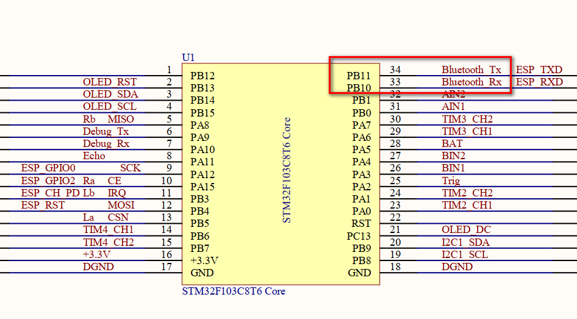
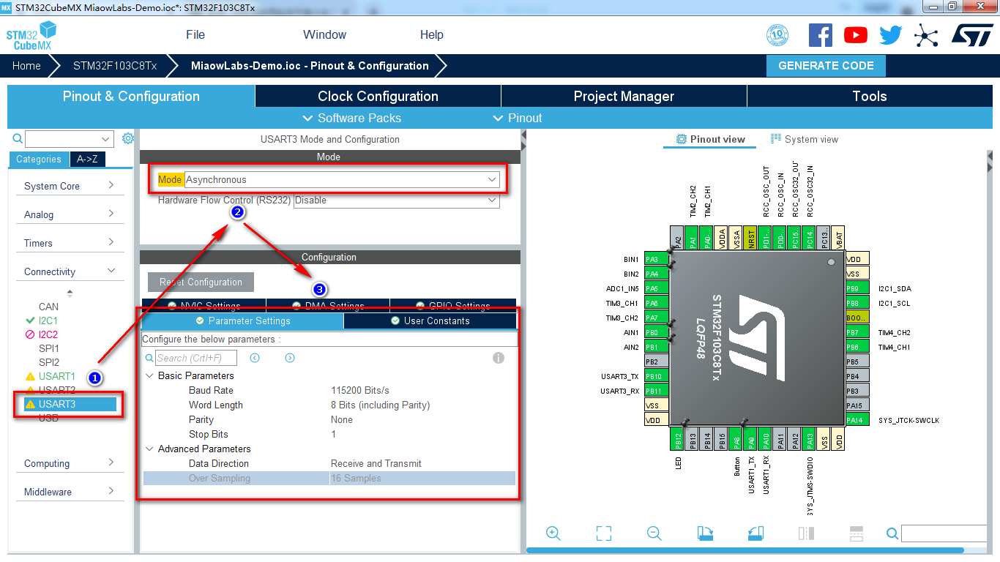

# 添加蓝牙遥控

*本小节教你给两轮自平衡小车添加蓝牙遥控功能。*

实验目的：通过串口助手发送指令，接收蓝牙返回的指令并打印在串口助手，实现对蓝牙相关数据的更改。Usart1 用于串口通讯，Usart3 用于蓝牙通讯，本程序使用串口中断模式发送与接收。

## 了解硬件

在配置 STM32CubeMX 之前，首先要弄清楚要配置哪些引脚和功能。通过查阅底板原理图，可以得知两轮自平衡小车的蓝牙模块 BT-06 是一个蓝牙从机模块，也是一个蓝牙传透模块，它连接了 STM32 的 USART3，即 PB10/PB11。所谓蓝牙从机模块，指的是该模块不能去搜索其他蓝牙设备，只能由其他蓝牙设备主动去连接它，它是被动的。

在使用方式上，BT-06 模块跟 USB-TTL 模块是一样的。

## 配置STM32CubeMX

我们之前的实验已经配置过 USART1 了，配置 USART3 也是类似的操作。

配置 USART3，其中 Mode 选择 Asynchronous，即异步通信。然后，在 Parameter Setting 中设置串口波特率为 115200 Bits/s，传输数据长度为8 Bit。奇偶检验无，停止位1。其他参数默认。如下图所示。

接着，在 NVIC Settings 中勾选 USART3 global interrupt。

然后点击 GENERATE CODE，生成代码。
