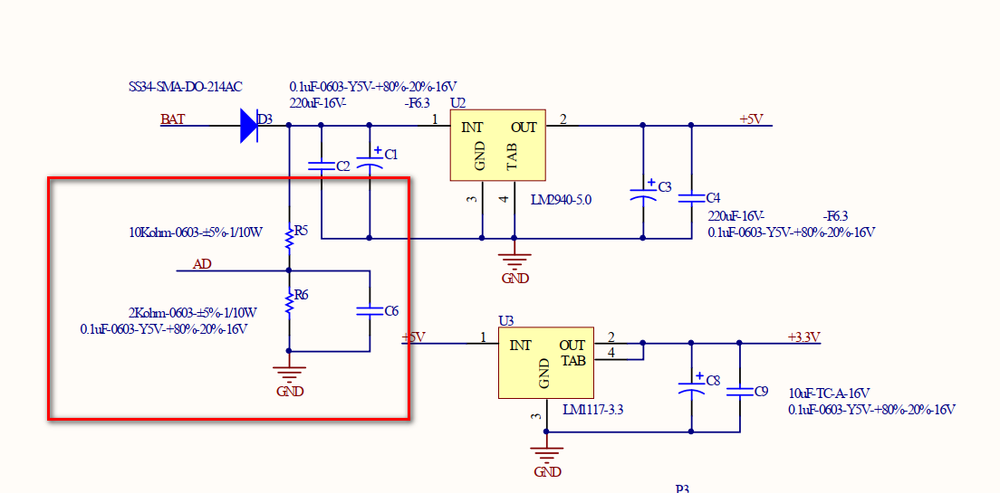

# 添加电池电压检测

> *本小节主要教你编写电池电压检测相关代码。*

## 了解硬件

我们的稳压模块上带有一个简单的电阻分压电路，并引出了相关引脚，可以连接 STM32 的 ADC 引脚，检测电池电压。



在小车系统中，我们把稳压模块的 AD 引脚连接到了 STM32 的 PA5 引脚，如图的红线标注所示。


## 配置STM32CubeMX

在 `Analog` 中选择 `ADC1` 设置，并选择 `IN5` 通道5。


或者在右边图找到 `PA5` 引脚，选择 `ADC1_IN5`。


具体配置参数如下。


ADC 时钟配置。ADC 分频系数设置为 6，ADC的输入时钟为 12。


点击 GENERATE CODE 生成代码。

打开上一小节的 MiaowLabs-Demo 工程，在左侧项目栏的`Application/User`文件夹中找到`control.c`，双击打开该文件。在该文件中加入 adc.h 头文件：

```c
#include "adc.h"
```


定义两个变量，并初始化。

```
unsigned short g_sADC_Value = 0;// ADC转换值存放
float g_fVoltage  = 0.0;        // 电压值
```


再编写一个读取电池电压的函数：

```
/*
	读取电池电压,返回值为实际电压值
*/
float GetBatVoltage(void)
{
	HAL_ADC_PollForConversion(&hadc1, 100);// 等待转换完成，第二个参数表示超时时间，单位ms
	g_sADC_Value = HAL_ADC_GetValue(&hadc1);// 为换取ADC状态
	g_fVoltage = (float)g_sADC_Value * 0.004834;// 0.4834= ((3.3/4096)/(2/(10+2)))，其中3.3v为参考电压，4096为12位ADC，2和10为电阻分压电路上的2K和10K电阻
	return g_fVoltage;// 返回值为实际电压值
	}
```


打开`control.h`，在里面声明这个函数。

```c
float GetBatVoltage(void);
```

再打开`main.c`文件，在`/* USER CODE BEGIN 1 */`和` /* USER CODE END 1 */`之间定义一个临时变量：

```c
float fTemp;
```

在`/* USER CODE BEGIN 2 */`和`/* USER CODE END 2 */`之间加入启动 ADC 转换语句：

```c
HAL_ADC_Start(&hadc1);// 启动ADC转换
```

在主循环`while(1)`中加入代码

```c
fTemp = GetBatVoltage();//获取电池电压
printf("电池电压 = %f \n",fTemp);//把电池电压打印出来
HAL_Delay(1000);//延时1秒
```

这样就可以通过串口助手查看电池电压了，我们打开 SSCOM 串口助手，或其他串口工具，设置波特率为 115200，数据位为 8 ，停止位为 1，打开串口，这时记得要打开小车的电源开关，就可以看到小车的实时电压了。


这时候，细心的同学会发现在加入了上面代码后，我们之前的按键控制 LED 功能失效了。因为我们在 main 函数中加入了延时函数，这导致按键功能失效，不过这里重点不在这里，我们后面实际应用到按键功能时，再去解决这里的按键失效问题。
